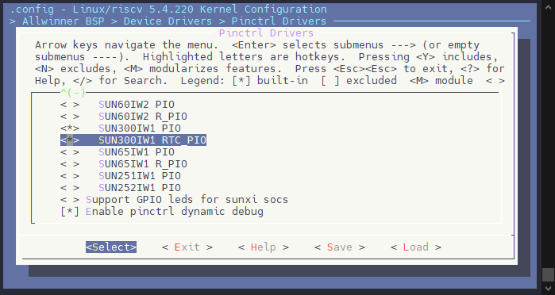
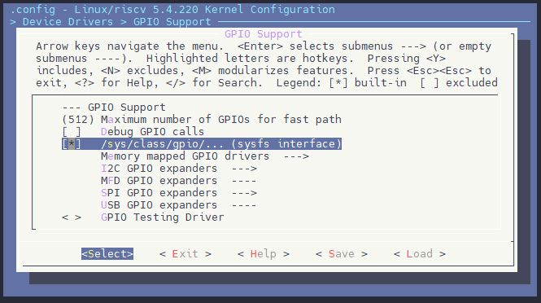
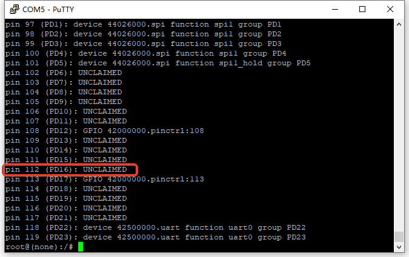
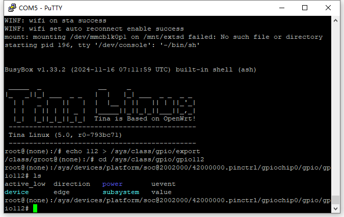

# GPIO - Pinctrl 控制器

Linux Pinctrl（引脚控制）子系统是 Linux 内核中用于管理和控制硬件引脚（GPIO、I2C、SPI等）的一个子系统。它允许 Linux 内核与底层硬件交互，配置和控制系统中的各种引脚以实现特定的功能。

## 模块配置

### 驱动配置

```
Allwinner BSP  --->
	Device Drivers  --->
		Pinctrl Drivers  --->
            <*> Pinctrl Support for Allwinner SoCs
            <*>   {CHIP_PLATFORM} PIO
            <*>   {CHIP_PLATFORM} RTC_PIO
```

:::tip

:::note

提示

:::
:::note

`{CHIP_PLATFORM}` 为对应芯片平台的标识符（如 V821 对应 SUN300IW1），具体名称请参考对应芯片的 SDK 驱动配置菜单。

:::

:::



### 设备树配置

对于 Pinctrl，设备树公共配置如下，这部分是定义控制器资源，中断，时钟，**开发一般无需修改**

```c
pio: pinctrl@42000000 {
    compatible = "allwinner,{chip_platform}-pinctrl";
    reg = <0x0 0x42000000 0x0 0x500>;
    interrupts-extended = <&plic0 68 IRQ_TYPE_LEVEL_HIGH>,
    <&plic0 72 IRQ_TYPE_LEVEL_HIGH>,
    <&plic0 74 IRQ_TYPE_LEVEL_HIGH>;
    clocks = <&aon_ccu CLK_APB0>, <&aon_ccu CLK_DCXO>,  <&losc>;
    clock-names = "apb", "hosc", "losc";
    device_type = "pio";
    gpio-controller;
    interrupt-controller;
    #interrupt-cells = <3>;
    #address-cells = <0>;
    #gpio-cells = <3>;
};
```

:::tip

:::note

提示

:::
:::note

`{chip_platform}` 为对应芯片平台的标识符（如 V821 对应 sun300iw1），具体 compatible 字符串请参考对应芯片的 SDK 设备树配置。

:::

:::

部分芯片平台存在两个 GPIO 域，一般来说 GPIO L 前的是 PIO 域，从 GPIO L 开始之后的是 RPIO 域，配置如下。**开发一般无需修改**

```c
rtc_pio: pinctrl@42000540 {
    #address-cells = <1>;
    compatible = "allwinner,{chip_platform}-rtc-pinctrl";
    reg = <0x0 0x42000540 0x0 0x100>;
    interrupts-extended = <&plic0 84 IRQ_TYPE_LEVEL_HIGH>; /* GPIOL */
    clocks = <&dcxo24M>;
    clock-names = "hosc";
    gpio-controller;
    #gpio-cells = <3>;
    interrupt-controller;
    #interrupt-cells = <3>;
};
```

:::tip

:::note

提示

:::
:::note

具体芯片平台是否存在 RTC PIO 域以及 compatible 字符串，请参考对应芯片的 SDK 设备树配置。

:::

:::

#### 配置通用GPIO功能/中断功能

这里以在 Linux 中配置一个按键为示例，讲解如何配置单个 IO 的功能与中断功能

```c
soc{
    gpiokey {
        device_type = "gpiokey";
        compatible = "gpio-keys";

        key_in_pio {
            device_type = "key_in_pio";
            label = "key_in_pio";
            gpios = <&pio PA 4 GPIO_ACTIVE_HIGH>;   // PL 前的 GPIO 使用 &pio
            linux,code = <0x1c>;
        };

        key_in_rtc {
            device_type = "key_in_rtc";
            label = "key_in_rtc";
            gpios = <&rtc_pio PL 3 GPIO_ACTIVE_HIGH>; // PL 后的 GPIO 使用 &rtc_pio
            linux,code = <0x1d>;
        };
    };
};
```

以下是这段设备树定义的内容：

| **字段** | **说明** |
| --- | --- |
| `device_type` | `"gpiokey"`：定义设备类型为 GPIO 按键设备。 |
| `compatible` | `"gpio-keys"`：表示设备与 `gpio-keys` 驱动兼容，适用于 Linux 内核中的 GPIO 按键驱动。 |
| **`key_in_pio`（按键配置）** |  |
| `device_type` | `"key_in_pio"`：该按键设备的类型是 `"key_in_pio"`。 |
| `label` | `"key_in_pio"`：按键的标签，用于标识该按键。 |
| `gpios` | `<&pio PA 4 GPIO_ACTIVE_HIGH>`：该按键连接到 PIO 的 `PA 4` 引脚，且引脚在按键按下时电平为高 (`GPIO_ACTIVE_HIGH`)。 |
| `linux,code` | `<0x1c>`：按键的扫描码为 `0x1c`，对应于某个键值（如 "OK" 按键）。 |
| **`key_in_rtc`（按键配置）** |  |
| `device_type` | `"key_in_rtc"`：该按键设备的类型是 `"key_in_rtc"`。 |
| `label` | `"key_in_rtc"`：按键的标签，用于标识该按键。 |
| `gpios` | `<&rtc_pio PL 3 GPIO_ACTIVE_HIGH>;`：该按键连接到RTC PIO的 `PL 3` 引脚，且引脚在按键按下时电平为高 (`GPIO_ACTIVE_HIGH`)。 |
| `linux,code` | `<0x1d>`：按键的扫描码为 `0x1d`，对应于某个键值（如 "WAKE" 按键）。 |

```c
gpios = <&pio  PA 4 GPIO_ACTIVE_HIGH>;
            |   |   |
            |   |   `------------------- gpio active时状态，如果需要上下拉，还可以或上GPIO_PULL_UP、GPIO_PULL_DOWN标志
            |   `----------------------- 哪个bank，这里是 bank PA
            `--------------------------- 指向哪个pio，这里是 PL 前的 GPIO，使用 &pio
                
gpios = <&rtc_pio  PL 4 GPIO_ACTIVE_HIGH>;
               |   |   |
               |   |   `------------------- gpio active时状态，如果需要上下拉，还可以或上GPIO_PULL_UP、GPIO_PULL_DOWN标志
               |   `----------------------- 哪个bank，这里是 bank PL
               `--------------------------- 指向哪个pio，这里是 PL 后的 GPIO，使用 &rtc_pio
```

#### 配置设备引脚

```c
&pio {
	uart0_pins_default: uart0_pins@0 {
		pins = "PD22", "PD23";
		function = "uart0";
	};

	uart0_pins_sleep: uart0_pins@1 {
		pins = "PD22", "PD23";
		function = "io_disabled";
	};
};

&uart0 {
	pinctrl-names = "default", "sleep";
	pinctrl-0 = <&uart0_pins_default>;
	pinctrl-1 = <&uart0_pins_sleep>;
	status = "okay";
};
```

这段设备树配置主要是为 UART0（串口0）配置两个不同的引脚状态：默认状态和睡眠状态。它描述了如何配置引脚复用功能和串口的状态。

-   `uart0_pins_default` ：默认状态
-   `uart0_pins_sleep`：睡眠状态

PIO 节点用于配置引脚实际IO，功能：

| **字段** | **说明** |
| --- | --- |
| `uart0_pins_default` | `uart0_pins@0`：定义了默认状态下 UART0 引脚的配置。 |
| `pins` | `"PD22", "PD23"`：指定引脚 `PD22` 和 `PD23` 用作 UART0 的 TX/RX 引脚。 |
| `function` | `"uart0"`：指定这两个引脚的功能为 UART0，允许它们用于串行通信。 |
| `uart0_pins_sleep` | `uart0_pins@1`：定义了睡眠状态下 UART0 引脚的配置。 |
| `pins` | `"PD22", "PD23"`：同样指定引脚 `PD22` 和 `PD23`，但在睡眠模式下这些引脚的功能被禁用。 |
| `function` | `"io_disabled"`：表示在睡眠状态下禁用这两个引脚的功能。 |

UART 节点引用配置的引脚，提供给驱动操作

| **字段** | **说明** |
| --- | --- |
| `pinctrl-names` | `"default", "sleep"`：定义了两种引脚配置名称，分别为默认配置和睡眠配置。 |
| `pinctrl-0` | `<&uart0_pins_default>`：指定默认状态下使用 `uart0_pins_default` 配置。 |
| `pinctrl-1` | `<&uart0_pins_sleep>`：指定睡眠状态下使用 `uart0_pins_sleep` 配置。 |
| `status` | `"okay"`：启用 UART0 控制器，表示 UART0 处于工作状态。 |

-   **默认状态 (`uart0_pins_default`)**: 在默认工作状态下，引脚 `PD22` 和 `PD23` 被配置为 UART0 的 TX 和 RX 引脚，支持串行通信功能。
-   **睡眠状态 (`uart0_pins_sleep`)**: 在睡眠模式下，引脚 `PD22` 和 `PD23` 的功能被禁用 (`io_disabled`)，以节省电能。
-   **`&uart0` 节点**: 定义了 UART0 控制器的引脚配置，使用 `default` 和 `sleep` 两种模式。

## 计算 GPIO 编号

## GPIO 号转换器

  

  

**源码定义**

全志的GPIO号在 sunxi-gpio.h 中定义

```c
sunxi-gpio.h
```

**GPIO号定义**

每个 BANK 有 32 组 GPIO，BANK A 作为 0，则 BANK B 为 32，以此类推。

```c
#define SUNXI_PA_BASE   0
#define SUNXI_PB_BASE   32
#define SUNXI_PC_BASE   64
#define SUNXI_PD_BASE   96
#define SUNXI_PE_BASE   128
#define SUNXI_PF_BASE   160
#define SUNXI_PG_BASE   192
#define SUNXI_PH_BASE   224
#define SUNXI_PI_BASE   256
#define SUNXI_PJ_BASE   288
#define SUNXI_PK_BASE   320
#define SUNXI_PL_BASE   352
#define SUNXI_PM_BASE   384
#define SUNXI_PN_BASE   416
#define SUNXI_PO_BASE   448
#define AXP_PIN_BASE    1024
```

**计算方式**

举两个例子

**1、PA13**

PA 是从0开始定义的，那么就是： 0 +13 = 13

那么 PA13 的GPIO号 就是 GPIO13

**2、PE10**

PE 是从128开始定义的，那么就是：128 + 10 = 138

那么 PE10 的GPIO号 就是 GPIO138

## 模块 SYS 接口

模块支持通过用户层调用，启用方法如下：

`make kernel_menuconfig`

```
Device Drivers  --->
	GPIO Support  --->
		[*]   /sys/class/gpio/... (sysfs interface)
```



这里以 PD16 为例，其 GPIO 号为 PD16，先检查是否被其他设备使用。

确认该 GPIO 没有被其他模块复用

```
cat /sys/kernel/debug/pinctrl/42000000.pinctrl/pinmux-pins
```

可以看到 PIN PD16 是 UNCLAIMED 的状态，PIN 号是 112 号，表示该 GPIO 没有被其他设备使用，其 IO 号是 112 号



导出该 GPIO

```
echo 112 > /sys/class/gpio/export
cd /sys/class/gpio/gpio112
```



然后再将该 IO 置为输出状态，即可操作其电平：

```
echo out > direction
echo 1 > value  # 拉高
echo 0 > value  # 拉低
```

## 驱动模块接口

**pinctrl\_get**

-   函数原型：`struct pinctrl *pinctrl_get(struct device *dev);`
    
-   作用：获取设备的pin操作句柄，所有pin操作必须基于此pinctrl句柄。
    
-   参数：
    
    -   dev：指向申请pin操作句柄的设备句柄。
-   返回：
    
    -   成功，返回pinctrl句柄。
    -   失败，返回NULL。

**pinctrl\_put**

-   函数原型：`void pinctrl_put(struct pinctrl *p)`
    
-   作用：释放pinctrl句柄，必须与pinctrl\_get配对使用。
    
-   参数：
    
    -   p：指向释放的pinctrl句柄。
-   返回：
    
    -   没有返回值。

**devm\_pinctrl\_get**

-   函数原型：`struct pinctrl *devm_pinctrl_get(struct device *dev)`
    
-   作用：根据设备获取pin操作句柄，所有pin操作必须基于此pinctrl句柄，与pinctrl\_get功能完全一样，只是devm\_pinctrl\_get会将申请到的pinctrl句柄做记录，绑定到设备句柄信息中。设备驱动申请pin资源， 推荐优先使用devm\_pinctrl\_get接口。
    
-   参数：
    
    -   dev：指向申请pin操作句柄的设备句柄。
-   返回：
    
    -   成功，返回pinctrl句柄。
    -   失败，返回NULL。

**devm\_pinctrl\_put**

-   函数原型：`void devm_pinctrl_put(struct pinctrl *p)`
    
-   作用：释放pinctrl句柄，必须与devm\_pinctrl\_get配对使用。
    
-   参数：
    
    -   p：指向释放的pinctrl句柄。
-   返回：
    
    -   没有返回值。

**pinctrl\_lookup\_state**

-   函数原型：`struct pinctrl_state *pinctrl_lookup_state(struct pinctrl *p, const char *name)`
    
-   作用：根据pin操作句柄，查找state状态句柄。
    
-   参数：
    
    -   p：指向要操作的pinctrl句柄。
    -   name：指向状态名称，如"default"、"sleep"等。
-   返回：
    
    -   成功，返回执行pin 状态的句柄struct pinctrl\_state \*。
    -   失败，返回NULL。

**pinctrl\_select\_state**

-   函数原型：`int pinctrl_select_state(struct pinctrl *p, struct pinctrl_state *s)`
    
-   作用：将pin句柄对应的pinctrl设置为state句柄对应的状态。
    
-   参数：
    
    -   p：指向要操作的pinctrl句柄。
    -   s：指向state 句柄。
-   返回：
    
    -   成功，返回0。
    -   失败，返回错误码。

**devm\_pinctrl\_get\_select**

-   函数原型：`struct pinctrl *devm_pinctrl_get_select(struct device *dev, const char *name)`
    
-   作用：获取设备的pin操作句柄，并将句柄设定为指定状态。
    
-   参数：
    
    -   dev：指向管理pin操作句柄的设备句柄。
    -   name：要设置的state名称，如"default"、"sleep"等。
-   返回：
    
    -   成功，返回pinctrl句柄。
    -   失败，返回NULL。

**devm\_pinctrl\_get\_select\_default**

-   函数原型：`struct pinctrl *devm_pinctrl_get_select_default(struct device *dev)`
    
-   作用：获取设备的pin操作句柄，并将句柄设定为默认状态。
    
-   参数：
    
    -   dev：指向管理pin操作句柄的设备句柄。
-   返回：
    
    -   成功，返回pinctrl句柄。
    -   失败，返回NULL。

**gpio\_request**

-   函数原型：`int gpio_request(unsigned gpio, const char *label)`
    
-   作用：申请gpio，获取gpio的访问权。
    
-   参数：
    
    -   gpio：gpio编号。
    -   label：gpio名称，可以为NULL。
-   返回：
    
    -   成功，返回0。
    -   失败，返回错误码。

**gpio\_free**

-   函数原型：`void gpio_free(unsigned gpio)`
    
-   作用：释放gpio。
    
-   参数：
    
    -   gpio：gpio编号。
-   返回：
    
    -   无返回值。

**gpio\_direction\_input**

-   函数原型：`int gpio_direction_input(unsigned gpio)`
    
-   作用：设置gpio为input。
    
-   参数：
    
    -   gpio：gpio编号。
-   返回：
    
    -   成功，返回0。
    -   失败，返回错误码。

**gpio\_direction\_output**

-   函数原型：`int gpio_direction_output(unsigned gpio, int value)`
    
-   作用：设置gpio为output。
    
-   参数：
    
    -   gpio：gpio编号。
    -   value：期望设置的gpio电平值，非0表示高, 0表示低。
-   返回：
    
    -   成功，返回0.
    -   失败，返回错误码。

**\_\_gpio\_get\_value**

-   函数原型：`int __gpio_get_value(unsigned gpio)`
    
-   作用：获取gpio电平值(gpio已为input/output状态)。
    
-   参数：
    
    -   gpio：gpio编号。
-   返回：
    
    -   返回gpio对应的电平逻辑，1表示高, 0表示低。

**\_\_gpio\_set\_value**

-   函数原型：`void __gpio_set_value(unsigned gpio, int value)`
    
-   作用：设置gpio电平值(gpio已为input/output状态)。
    
-   参数：
    
    -   gpio：gpio编号。
    -   value：期望设置的gpio电平值，非0表示高, 0表示低。
-   返回：
    
    -   无返回值

**of\_get\_named\_gpio**

-   函数原型：`int of_get_named_gpio(struct device_node *np, const char *propname, int index)`
    
-   作用：通过名称从dts解析gpio属性并返回gpio编号。
    
-   参数：
    
    -   np：指向使用gpio的设备结点。
    -   propname：dts中属性的名称。
    -   index：dts中gpio属性的索引值。
-   返回：
    
    -   成功，返回gpio编号。
    -   失败，返回错误码。

**of\_get\_named\_gpio\_flags**

-   函数原型：`int of_get_named_gpio_flags(struct device_node *np, const char *list_name, int index, enum of_gpio_flags *flags)`
    
-   作用：通过名称从dts解析gpio属性并返回gpio编号。
    
-   参数：
    
    -   np：指向使用gpio的设备结点。
    -   propname：dts中属性的名称。
    -   index：dts中gpio属性的索引值
    -   flags：输入、输出信息`of_gpio_flags`
-   返回：
    
    -   成功，返回gpio编号。
    -   失败，返回错误码。

## 使用示例

### 配置设备引脚

一般设备驱动只需要使用一个接口 `devm_pinctrl_get_select_default` 就可以申请到设备所有pin资源。

```c
static int pin_req_demo(struct platform_device *pdev)
{
	struct pinctrl *pinctrl;
	pinctrl = devm_pinctrl_get_select_default(&pdev->dev);
	if (IS_ERR_OR_NULL(pinctrl))
		return -EINVAL;
	return 0;
}
```

### 获取GPIO号

```c
static int pin_req_demo(struct platform_device *pdev)
{
	struct device *dev = &pdev->dev;
	struct device_node *np = dev->of_node;
	unsigned int gpio;
	gpio = of_get_named_gpio(np, "vdevice_3", 0);
	if (!gpio_is_valid(gpio)) {
		if (gpio != -EPROBE_DEFER)
			dev_err(dev, "Error getting vdevice_3\n");
		return gpio;
	}
}
```

### GPIO属性配置

通过`pin_config_set`/`pin_config_get`/`pin_config_group_set`/`pin_config_group_get`接口单独控制指定pin或group的相关属性。

```c
static int pctrltest_request_all_resource(void)
{
    struct device *dev;
    struct device_node *node;
    struct pinctrl *pinctrl;
    struct sunxi_gpio_config *gpio_list = NULL;
    struct sunxi_gpio_config *gpio_cfg;
    unsigned gpio_count = 0;
    unsigned gpio_index;
    int ret;

    dev = bus_find_device_by_name(&platform_bus_type, NULL, sunxi_ptest_data->dev_name);
    if (!dev) {
        pr_warn("find device [%s] failed...\n", sunxi_ptest_data->dev_name);
        return -EINVAL;
    }

    node = of_find_node_by_type(NULL, dev_name(dev));
    if (!node) {
        pr_warn("find node for device [%s] failed...\n", dev_name(dev));
        return -EINVAL;
    }
    dev->of_node = node;

    pr_warn("++++++++++++++++++++++++++++%s++++++++++++++++++++++++++++\n", __func__);
    pr_warn("device[%s] all pin resource we want to request\n", dev_name(dev));
    pr_warn("-----------------------------------------------\n");

    pr_warn("step1: request pin all resource.\n");
    pinctrl = devm_pinctrl_get_select_default(dev);
    if (IS_ERR_OR_NULL(pinctrl)) {
        pr_warn("request pinctrl handle for device [%s] failed...\n", dev_name(dev));
        return -EINVAL;
    }

    pr_warn("step2: get device[%s] pin count.\n", dev_name(dev));
    ret = dt_get_gpio_list(node, &gpio_list, &gpio_count);
    if (ret < 0 || gpio_count == 0) {
        pr_warn(" devices own 0 pin resource or look for main key failed!\n");
        return -EINVAL;
    }

    pr_warn("step3: get device[%s] pin configure and check.\n", dev_name(dev));
    for (gpio_index = 0; gpio_index < gpio_count; gpio_index++) {
        gpio_cfg = &gpio_list[gpio_index];

        // 配置GPIO功能
        ret = pinctrl_gpio_set_config(dev, gpio_cfg->name, gpio_cfg->mulsel);
        if (ret < 0) {
            pr_warn("failed to set function config for pin %s\n", gpio_cfg->name);
            return -EINVAL;
        }

        // 配置GPIO上下拉
        if (gpio_cfg->pull != GPIO_PULL_DEFAULT) {
            ret = pinctrl_gpio_set_config(dev, gpio_cfg->name, gpio_cfg->pull);
            if (ret < 0) {
                pr_warn("failed to set pull config for pin %s\n", gpio_cfg->name);
                return -EINVAL;
            }
        }

        // 配置GPIO驱动能力
        if (gpio_cfg->drive != GPIO_DRVLVL_DEFAULT) {
            ret = pinctrl_gpio_set_config(dev, gpio_cfg->name, gpio_cfg->drive);
            if (ret < 0) {
                pr_warn("failed to set drive level config for pin %s\n", gpio_cfg->name);
                return -EINVAL;
            }
        }

        // 配置GPIO初始状态
        if (gpio_cfg->data != GPIO_DATA_DEFAULT) {
            ret = pinctrl_gpio_set_config(dev, gpio_cfg->name, gpio_cfg->data);
            if (ret < 0) {
                pr_warn("failed to set initial data config for pin %s\n", gpio_cfg->name);
                return -EINVAL;
            }
        }
    }

    pr_warn("-----------------------------------------------\n");
    pr_warn("test pinctrl request all resource success!\n");
    pr_warn("++++++++++++++++++++++++++++end++++++++++++++++++++++++++++\n\n");
    return 0;
}
```

### GPIO 中断配置

#### 驱动申请中断

设备驱动只需要通过`gpio_to_irq`获取虚拟中断号后，其他均可以按标准irq接口操作。

```c
static int gpio_eint_demo(struct platform_device *pdev)
{
    struct device *dev = &pdev->dev;
    int virq;
    int ret;
    /* map the virq of gpio */
    virq = gpio_to_irq(GPIOA(0));
    if (IS_ERR_VALUE(virq)) {
        pr_warn("map gpio [%d] to virq failed, errno = %d\n",
        GPIOA(0), virq);
        return -EINVAL;
    }
    pr_debug("gpio [%d] map to virq [%d] ok\n", GPIOA(0), virq);
    /* request virq, set virq type to high level trigger */
    ret = devm_request_irq(dev, virq, sunxi_gpio_irq_test_handler,
    IRQF_TRIGGER_HIGH, "PA0_EINT", NULL);
    if (IS_ERR_VALUE(ret)) {
        pr_warn("request virq %d failed, errno = %d\n", virq, ret);
        return -EINVAL;
    }
    return 0;
}
```

#### DT 方法申请中断

配置设备树

```c
soc{
  vdevice: vdevice@0 {
    compatible = "allwinner,sun8i-vdevice";
    device_type = "Vdevice";
    interrupt-parent = <&pio>;/* 依赖的中断控制器(带interrupt-controller属性的结点) */
    interrupts = < PD 3 IRQ_TYPE_LEVEL_HIGH>;
                    | |      `------------------中断触发条件、类型
                    | `-------------------------pin bank内偏移
                    `---------------------------哪个bank
    pinctrl-names = "default";
    pinctrl-0 = <&vdevice_pins_a>;
    test-gpios = <&pio PC 3 1 2 2 1>;
    status = "okay";
  };
};
```

在驱动中，通过 `platform_get_irq()` 标准接口获取虚拟中断号

```c
static int pctrltest_probe(struct platform_device *pdev)
{
	struct device_node *np = pdev->dev.of_node;
	struct gpio_config config;
	int gpio, irq;
	int ret;

	if (np == NULL) {
		pr_err("Vdevice failed to get of_node\n");
		return -ENODEV;
	}
  irq = platform_get_irq(pdev, 0);
  if (irq < 0) {
    printk("Get irq error!\n");
    return -EBUSY;
  }
  sunxi_ptest_data->irq = irq;
  return ret;
}
```

申请中断

```c
static int request_irq(void)
{
	int ret;
	int virq = sunxi_ptest_data->irq;
	int trigger = IRQF_TRIGGER_HIGH;

	reinit_completion(&sunxi_ptest_data->done);

	pr_warn("step1: request irq(%s level) for irq:%d.\n",
			trigger == IRQF_TRIGGER_HIGH ? "high" : "low", virq);
	ret = request_irq(virq, sunxi_pinctrl_irq_handler_demo1,
					trigger, "PIN_EINT", NULL);
	if (IS_ERR_VALUE(ret)) {
		pr_warn("request irq failed !\n");
		return -EINVAL;
	}

	pr_warn("step2: wait for irq.\n");
	ret = wait_for_completion_timeout(&sunxi_ptest_data->done, HZ);
	if (ret == 0) {
		pr_warn("wait for irq timeout!\n");
		free_irq(virq, NULL);
		return -EINVAL;
	}

	free_irq(virq, NULL);

	pr_warn("-----------------------------------------------\n");
	pr_warn("test pin eint success !\n");
	pr_warn("+++++++++++++++++++++++++++end++++++++++++++++++++++++++++\n\n\n");

	return 0;
}
```

#### DT 配置中断 debounce

**中断去抖动（Debounce）** 是一种常见的硬件和软件技术，通常用于处理按键或开关等机械设备的信号输入。在这些设备中，由于物理接触不稳定，按键按下或释放时可能会出现短时间内的多次触发（即“抖动”），这会导致不必要的多次中断或事件触发。去抖动的目标是消除这些不必要的“噪音”信号，确保每次按键事件只触发一次。可以通过 `dts` 配置每个中断 `bank` 的 `debounce`：

```c
&pio {
	/* takes the debounce time in usec as argument */
	input-debounce = <0 0 0 0 0 0 0>;
			  | | | | | | `----------PA bank
			  | | | | | `------------PC bank
			  | | | | `--------------PD bank
			  | | | `----------------PF bank
			  | | `------------------PG bank
			  | `--------------------PH bank
			  `----------------------PI bank
};
```

-   `input-debounce` 的属性值中需把 `pio` 设备支持中断的 `bank` 都配上，如果缺少，会以 `bank` 的顺序设置相应的属性值到`debounce`寄存器，缺少的 `bank` 对应的 `debounce`应该是默认值（启动时没修改的情况）。`debounce`取值范围是`0~1000000`（单位usec）。

## 调试方法

### 寄存器调试

开启 SUNXI DUMP

```
cd /sys/class/sunxi_dump
1.查看一个寄存器
  echo 0x0300b048 > dump ;cat dump

2.写值到寄存器上
  echo 0x0300b058 0xfff > write ;cat write

3.查看一片连续寄存器
  echo 0x0300b000,0x0300bfff > dump;cat dump

4.写一组寄存器的值
  echo 0x0300b058 0xfff,0x0300b0a0 0xfff > write;cat write
```

### DEBUG FS

挂载 DEBUG FS

```
mount -t debugfs none /sys/kernel/debug
cd /sys/kernel/debug/sunxi_pinctrl
```

1.  查看 PIN 下的设备

```
cat pinctrl-devices
```

2.  查看 PIN 的状态和对应的使用设备

```
console:/sys/kernel/debug/pinctrl # ls
pinctrl-devices pinctrl-handles pinctrl-maps pio r_pio
console:/sys/kernel/debug/pinctrl # cat pinctrl-handles

Requested pin control handlers their pinmux maps:
device: twi3 current state: sleep
  state: default
    type: MUX_GROUP controller pio group: PA10 (10) function: twi3 (15)
    type: CONFIGS_GROUP controller pio group PA10 (10)config 00001409
config 00000005
    type: MUX_GROUP controller pio group: PA11 (11) function: twi3 (15)
    type: CONFIGS_GROUP controller pio group PA11 (11)config 00001409
config 00000005
  state: sleep
    type: MUX_GROUP controller pio group: PA10 (10) function: io_disabled (5)
    type: CONFIGS_GROUP controller pio group PA10 (10)config 00001409
config 00000001
    type: MUX_GROUP controller pio group: PA11 (11) function: io_disabled (5)
    type: CONFIGS_GROUP controller pio group PA11 (11)config 00001409
config 00000001
device: twi5 current state: default
  state: default
    type: MUX_GROUP controller r_pio group: PL0 (0) function: s_twi0 (3)
    type: CONFIGS_GROUP controller r_pio group PL0 (0)config 00001409
config 00000005
    type: MUX_GROUP controller r_pio group: PL1 (1) function: s_twi0 (3)
    type: CONFIGS_GROUP controller r_pio group PL1 (1)config 00001409
config 00000005
  state: sleep
    type: MUX_GROUP controller r_pio group: PL0 (0) function: io_disabled (4)
    type: CONFIGS_GROUP controller r_pio group PL0 (0)config 00001409
config 00000001
    type: MUX_GROUP controller r_pio group: PL1 (1) function: io_disabled (4)
    type: CONFIGS_GROUP controller r_pio group PL1 (1)config 00001409
config 00000001
device: soc@03000000:pwm5@0300a000 current state: active
  state: active
    type: MUX_GROUP controller pio group: PA12 (12) function: pwm5 (16)
    type: CONFIGS_GROUP controller pio group PA12 (12)config 00000001
config 00000000
config 00000000
  state: sleep
    type: MUX_GROUP controller pio group: PA12 (12) function: io_disabled (5)
    type: CONFIGS_GROUP controller pio group PA12 (12)config 00000001
config 00000000
config 00000000
device: uart0 current state: default
  state: default
  state: sleep
device: uart1 current state: default
  state: default
    type: MUX_GROUP controller pio group: PG6 (95) function: uart1 (37)
    type: CONFIGS_GROUP controller pio group PG6 (95)config 00001409
config 00000005
    type: MUX_GROUP controller pio group: PG7 (96) function: uart1 (37)
    type: CONFIGS_GROUP controller pio group PG7 (96)config 00001409
config 00000005
    type: MUX_GROUP controller pio group: PG8 (97) function: uart1 (37)
    type: CONFIGS_GROUP controller pio group PG8 (97)config 00001409
config 00000005
    type: MUX_GROUP controller pio group: PG9 (98) function: uart1 (37)
    type: CONFIGS_GROUP controller pio group PG9 (98)config 00001409
config 00000005
  state: sleep
    type: MUX_GROUP controller pio group: PG6 (95) function: io_disabled (5)
    type: CONFIGS_GROUP controller pio group PG6 (95)config 00001409
config 00000001
    type: MUX_GROUP controller pio group: PG7 (96) function: io_disabled (5)
    type: CONFIGS_GROUP controller pio group PG7 (96)config 00001409
config 00000001
    type: MUX_GROUP controller pio group: PG8 (97) function: io_disabled (5)
    type: CONFIGS_GROUP controller pio group PG8 (97)config 00001409
config 00000001
    type: MUX_GROUP controller pio group: PG9 (98) function: io_disabled (5)
    type: CONFIGS_GROUP controller pio group PG9 (98)config 00001409
    ....
```

从上面的部分 `log` 可以看到那些设备管理的 `pin` 以及 `pin` 当前的状态是否正确。以 `twi3` 设备为例，`twi3` 管理的 `pin` 有 `PA10/PA11`，分别有两组状态 `sleep` 和 `default`，`default` 状态表示使用状态，`sleep` 状态表示 `pin` 处于 `io disabled` 状态，表示 `pin` 不可使用，`twi3` 设备使用的 `pin`当前状态处于`sleep`状态的。
