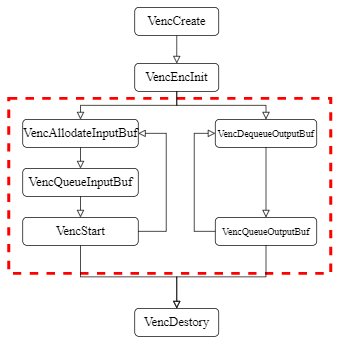

# Linux Encoder 开发指南

## 前言

### 文档简介

本文档重点阐述 Allwinner 平台视频编码的驱动开发方法、使用规范与调试技巧。目的是为了视频编码系统开发与支持等相关技术人员，能对 Allwinner 平台视频编码器的驱动体系有更深入的理解，并通过实际应用指导快速开展高效开发、定位问题与解决问题。文档详细介绍了编码器的接口设计、数据结构、配置方法及最佳实践，为开发者提供全面的技术参考。

### 目标读者

视频编码系统开发人员、视频编码系统技术支持人员

### 符号约定

本文档中会使用不同符号区分信息类型，具体释义如下：

:::note

:::note

备注

:::
:::note

用于呈现技术核心信息（如功能原理、核心参数定义）、流程补充内容（如步骤细节说明）等。

:::

:::
:::tip

:::note

提示

:::
:::note

用于分享技术操作中的高效方法（如命令行快捷指令、配置项优化窍门）与实践技巧。

:::

:::
:::warning

:::note

注意

:::
:::note

用于突出技术操作中易出错的环节（如参数配置边界、操作顺序要求）的提示。

:::

:::

### 适用平台

| 平台 | 内核版本 |
| --- | --- |
| V861 | Linux 5.10及以上内核版本 |

### 相关术语

| 术语 | 解释 |
| --- | --- |
| CABAC | Context-based Adaptive Binary Arithmetic Coding，基于上下文的自适应二进制算术编码 |
| CAVLC | Context-based Adaptive Variable Length Coding，基于上下文的自适应可变长度编码 |
| Encoder | 视频编码器，将原始视频数据压缩编码为特定格式（如H.264、JPEG等）的硬件或软件模块 |
| H.264 | 一种高效的视频压缩编码标准，也称为MPEG-4 AVC |
| I帧 | Intra-frame，帧内编码帧，可独立编码的完整图像帧 |
| JPEG | 联合图像专家小组制定的静态图像压缩标准 |
| P帧 | Predicted-frame，预测帧，基于前面的I帧或P帧进行预测编码 |
| QP | Quantization Parameter，量化参数，影响编码质量和码率 |
| ROI | Region of Interest，感兴趣区域，可对视频中特定区域进行特殊处理 |
| SVC | Scalable Video Coding，可伸缩视频编码，支持时域、空域等多种可伸缩性 |
| VBV | Video Buffer Verifier，视频缓冲验证器，用于控制码率输出 |

## 概述

本章节主要介绍Allwinner平台V861芯片的视频编码技术规格及编码特性。

### Encoder功能概述

Allwinner平台Encoder模块支持JPEG、H.264、H265格式编码，本节将详细介绍其主要特性，包括支持的编码格式、分辨率范围、编码模式等关键参数，帮助开发者充分了解编码器的能力边界和优化空间。

#### H.264编码特性

H.264编码是Encoder模块的核心功能之一，具有以下特性：

-   **Profile支持**：支持Baseline Profile、Main Profile、High Profile 5.1
-   **编码模式**：支持I帧、P帧编码
-   **熵编码方式**：支持CABAC和CAVLC
-   **码率控制**：支持CBR（恒定码率）、VBR（可变码率）、AVBR（适配式可变码率控制方式）等多种码率控制方式
-   **特殊功能**：支持ROI编码、循环帧内刷新、时域SVC等高级特性
-   **最大性能**：4k@30fps

#### H.265编码特性

H.264编码是Encoder模块的核心功能之一，具有以下特性：

-   **Profile支持**：支持Main Profile 5.0
-   **编码模式**：支持I帧、P帧编码
-   **熵编码方式**：支持CABAC
-   **码率控制**：支持CBR（恒定码率）、VBR（可变码率）、AVBR（适配式可变码率控制方式）等多种码率控制方式
-   **特殊功能**：支持ROI编码、循环帧内刷新、时域SVC等高级特性
-   **最大性能**：4k@35fps

#### JPEG编码特性

JPEG编码主要用于静态图像压缩，具有以下特性：

-   **质量控制**：支持0-100级的质量参数调整
-   **EXIF支持**：支持嵌入图像元数据信息
-   **编码模式**：支持单帧JPEG编码和MJPEG序列编码
-   **最大性能**：4k@30fps

## 模块驱动开发

本章节介绍Allwinner平台视频编码的结构设计、核心模块功能及API接口规范，帮助开发者理解编码系统的整体架构和模块间的交互关系。

### 视频编码的模块架构简介

视频编码库采用模块化架构设计，主要由四个核心模块组成，分别为帧缓冲输入管理模块、视频编码设备、码流输出管理模块、编码控制模块，各模块职责明确，协同工作完成视频编码功能，如下图所示：

![视频编码库模块结构图](data:image/png;base64,iVBORw0KGgoAAAANSUhEUgAAAjcAAACECAYAAABs6QpcAAAABHNCSVQICAgIfAhkiAAAAAlwSFlzAAAOxAAADrsBPYxrIgAAHrxJREFUeJzt3UFo41j+J/Bv/ttMK38GRmH/MDIslAIDLZ9agV3aOUU+tXMqhT3EOcU+xTkslcBCVeZi57JJ2EMqhyXpk51TXOwhzimpk12nuGEg7lPc8AcrsGA1DBMzO7vWNLP/t4e0Xlu2U3FSdpyovh8QXR3Z0rP0e08/vfdkTwghQERERBQW/zTuAhARERENE5MbIiIiChUmN0RERBQqTG6IiIgoVJjcEBERUagwuSEiIqJQYXJDREREocLkhoiIiEKFyQ0RERGFCpMbIiIiChUmN0RERBQqTG6IiIgoVJjcEBERUagwuSEiIqJQYXJDREREocLkhoiIiEKFyQ0RERGFyhfjLgBRWFWr1djGxsb/AG8iniVFUf5vPp//z5qmueMuCxHdD5MbohGp1+uGoijR169fT467LHR/6+vrf6vX6waTG6Lnh8kN0Qhpmvb/LMsadzHoAVRV/ce4y0BED8PuciIiIgoVJjdEREQUKkxuiIiIKFSY3BAREVGoMLkhIiKiUGFyQ0RERKHC5IaIiIhChckNERERhQqTGyIiIgoVJjdE9OgqlQparda4i0FEIcXkhogeXTweR61WG3cxiCikmNwQjYiiKJ7nef827nLQwyiKAs/zlHGXg4juj8kN0Yhomua6rvtoyU29Xkcul4PneYG/b29vo16vAwBarRaKxSJyuRyq1WrgdblcDq1WC2dnZ33XA0C1WsX29nbfdZVKBblcDsVisWfIyXVdFAoFHBwcwHV7f2TbcRwcHBzg7du3sqz+39++fSv/27lu1DRN+8J1Xe3RdkhEQ8PkhigkdF3H3t4ezs7O5N9qtRo2Nzehqirq9Tqi0Sg2Nzfx008/IR6PI51Oy9dubm5iaWkJ6+vruLq6Qjwex8bGhly/urqKeDyOq6srpNNpzMzMyHULCwuYn5/HTz/9hI2NDUSjUZmIOI6DaDSKvb09fPjwAbOzs4FyF4tFRKNRnJyc4MOHD4hGo3j79q18787ODuLxOA4PD1GpVEZx6IgoZL4YdwHoRr1eN3iXGC61Ws38+eefH+0GQlEUJJNJHB4ewrZtAMDh4SESiQQ0TcPq6ipisRiOj48BAFtbW4hEIlhcXEQikQBwkyCdnp4CAL766it899132NrawtnZGQ4ODnB5eQnDMOB5HqLRKKrVKur1Os7OztBoNKBpNyHsJ0bHx8dYX19HLBaT261WqzLB8TwP6+vr2NrawtraGgDg7OwMCwsLSCaTAG56fY6OjuT/P5Z2uz1Rr9eNSqViPeqO6VkzTbOmqipny48Zk5snYn5+/lTTNFdRFO/uV9Nz0Gq11J9//vlR69jy8jLi8Thc14WqqigWi9jf3wdwM2xkWRZyuZx8vaZp+PDhg0xuvvnmG7nOMAw5vFSr1WCaJgzDAHCTSDUaDQA3CVQsFpOJDQAsLi7KXp9qtYrXr1/LdbFYDLquA7jpmXFdF1dXV4FyeZ6HarUKVVUBAJZlDeHo3I/ruv/uhx9+ePn9999/c/eriQDHcfTl5eXDXGcw01gwuXlCjo6OlnRdd8ZdDhqOSqVibW5uHgP458fap584FItFmYj4iUur1YKiBOfHLi8vwzRN+f9+0gEAqqrK5Obq6irwuk6e5wUSGwCyd8df37ld/29+mQD0lCubzULXdbm+e/uPYXp6+h+pVGonlUoVHn3n9CwxqXk6mNwQhczy8jLevXsHwzCQTCZl4mCaJjRNC/SQFAqFW5OWTl999RXevXsX+Nv6+jq+/vprvHjxAnt7e4F1ruvK5MowDLx//14Olfm9Nf46APj666/lsJPneSgUCtB1nY+LE9GDcEIxUcikUilUq1WUSiUsLy/Lv6+srKBQKKBQKKDVaqFQKGB1dXWgbSaTSdTrdWxvb8N1XZRKJRwcHCCRSCCTycDzPKyursqnojY2NrC4uAgAePXqFYrFIgqFAhzHwebmptyuqqpIJpPY2dnB2dkZXNfFxsYG9vb2enpziIgGxeSGKGQ0TcPa2hoSiUSgVyaTyeD169fY29tDJBLByckJjo6O5JCRZVlyjgtwk3j4c100TcPp6Sk+fPiASCSCdDqN3d1daJoGTdNQLpfhOA4ikQj29vbw6tUrvHnzBsBNYpTNZrGzs4OZmRmZ0Pj72t/fRyKRwOrqKqLRKFzXRT6fh6IogTIQEQ1qQggx7jIQgOnp6Ua5XI5zzk14+HNuyuWyever6alJp9N/m5ub+y+cc0OD8ufccO7N+LHnhoiIiEKFyQ0RERGFCpMbIiIiChUmN0RERBQqTG6IRuSXXwUfdzHogRRF+Sf+KjjR88TkhmhEfvlVcH5R5jP1+9///p/5e29EzxOTGyIiIgoVJjdEREQUKkxuiIiIKFSY3BAREVGoMLkhogerVqvgE2FE9NTwSQ6iEVEUxXNdV4nH461xl2VUarXab3Vd91RV/ce4yzJsjuMor169Cu25IwozJjdEI6Jpmnt+fv6fWq1WaH84c319fXd5efnQNM3auMsyCpZlVcZdBiK6PyY3RCMU1ou+T1XVlmmaNSYBRPSUcM4NERERhQqTGyIiIgoVJjdEREQUKkxuiIiIKFSY3BAREVGoMLkhIiKiUGFyQ0RERKHC5IaIiIhChckNERERhQqTGyIiIgoVJjdEREQULkIILo+86LreACAGWS4vL41xl5cLFyEETNO8GDRuT09PE+MuLxcuo1y2trbeDFofUqlUftzl/dwW9tyMQTKZLA7yOsMw6oZh1EddHqJBLC4uvhvkdaqqtvhDmhR2g7bjwOB1h4aHyc0YvHz58mSQ17FC0FMyaGNu23ZJURRv1OUhGidd151YLFa963VM9seDyc0YxGKxqq7rzl2vu8+dAdGoDdqYMymnz8UgN6pM9seDyc2Y3JW4cEiKnqK7GnPepdLnZJAbUCb748HkZkzuukiwQtBTdFdjzrtU+pzc1ZvJZH98mNyMyV1DUxySoqforsacSTl9bj52o8pkf3yY3IzRbQkMh6ToKbutMeddKn2OPnYjymR/fJjcjNG33377vt/fWSHoKbutMeddKn2ObuvNZLI/XkxuxsiyrIqmaW733zkkRU/ZbY05k3L6XPXrzWSyP15MbsbMtu1S5/9zSIqeg+7GnHep9Dnrd0PKZH+8mNyMWXcFYIWg56C7MeddKn3OunszmeyPH5ObMesemuKQFD0H3Y05k3L63HX2ZjLZHz8mN0+APzTFISl6TvzGnHepRMEbUyb748fk5gnwKwIrBD0nfmPOu1SiX3szmew/DV+MuwD069AUh6ToOfEbcyblRDdevnx5YhhGncn++E0IIYa2sVKpZNdqNXNoG/yMVKvV2CA/Ski9VFVtra2tvR3Fth3H0QuFQmoU2w6DP/3pT//RNM3aF1988Y9xlyVsbNsumaZZe+z9MuYfrtVqqX/+85//5Q9/+MO/jrssz9EwY36oyc3ExITIZrND2x7RIE5OTrzXr1+nR9HztbGx8d+r1ep/nZubG/amiW51dXUFx3Fq5XJ55rH3zZincRh2zA99WCqXyw17k0QfdXV19Q/P85RRbPvLL7/8P3Nzc4xrelSVSgWbm5tj2TdjnsZh2DHPCcVEREQUKkxuiIiIKFSY3BAREVGoDDW50XX9z47jDHOTRESfHV3X4TjOfxh3OYgey7Bjnj03REREFCpMboiIiChUmNwQERFRqDC5ISIiolBhckPP3osXL37rOI4+im3ruu5cXV39bRTbJnqKGPMUBkxuiIiIKFSeTHLjui7i8XjfZXt7e9zFAwDE43HUag//Ta9cLod4PI719XW0Wi0sLS0hHo+jUCjce1uFQgHxeBwHBwd916+uriIej8N13QeXl8bD8zzMz8/j7Oys7/pCoYClpaVHLtXt/Lr70FjzY9lfFhYWkMvlMKyvlfjU8tFwnZ2d9T3f9Xpdvqb7nLmuO/D5cxwHrVZrJGW/Lz+2b7uGsZ0enSeT3Hieh0qlAl3XMTc3F1gMwxh38QDc/PbFQytNtVrF5uYmFhcXsby8jJ2dHVQqFbx69QqJROLe23McB5VKBTs7Oz3rXNfFwcEBKpUKPM97UHlpfBRFgaqq+O677/qu39vbg6Zpj1yq2/l196Gx5jgOHMeR9f3rr7/G+/fvMT09fWuCdx+KomBubg6KMpKfH6N7cl0XlUolcL6///57zM7OolqtAug9Z9FoNJD8fGzb0Wj0ySQ3fju9t7fXs47t9GgN/YczP9Xy8jIsyxp3MYbOcRxomoZMJgPg5gJlWRZs237wNmOxGGq1GqrVKmKxmPx7sViEZVmoVCqfWuzQq9Vq5uHh4XKpVLLz+XzasqzKuMsEACsrK5ifn4fruoFEpl6vo1arIZ/Pj7F0w6freuCHGnO5HDY2NpBOp3FxcfFJyZyqqp/tj0AWCoXUzs7O68XFxXfJZLJoGMbdGcIj6T4n8Xgc7969QywW6zlngyYrnuc9uURB0zR5A9B5bSuVSmynR2jY31D8v0b5DcXxeBy5XA4TExOIRqMAbrr9JicnMTExgYmJCczMzMgMP5fLYWlpCel0GhMTE4hEIiiVStje3sbk5CSmpqawvr4ut+95HjY2NuS2IpFIz53jycmJ3F88Hpdd55VKBRMTE4HXptNppNNpOYzguq4sY6FQQLFYlO/xu2H9fc/Ozga2PT09LT+HPxSlKAps28a7d+8C+3337h0WFxcDf/M/c7/t+8dpaWlJrt/Y2JDvrVariEajgeNSKpXk+lKpJNdPT09jfX0d8Xi8776npqYCw3DT09M953TUarWaub6+vjs9Pd2YmZm5ePv27dqoJiQ/lGVZ0HUdxWIx8PfDw0OYpgnTNOXQpn9eotGoHDZ1HAcTExMoFAqYmpqS6zvvfguFAqanp2VMdsb6wcGBfN/k5CTevn0r13meh4WFBXk+u3uY6vU6ZmZmZLnm5+flxalzCGpiYuKjPTOvX7+Wd/n+ftfX1/vWz/X1dczPzwfev729jdnZWQDAxMSE3I7jOHL/U1NTSKfT8oJYr9cxOzsbKPs4hgx++bbWfxnGtur1urG5uZmNRqOX0Wj0MpfL5er1+tPoDu/yu9/9DsCv8es4DqanpwH82v63Wi3Mz88H4sDv8fFfOz09jUKhINvemZkZTE5Oyt737nrjvx9AoM501ys/fv04nJqawsHBgXzP5OQkVldXA59JURQkk8mRtNOd++pup6empgLtR2c7HYlE7tVO97v2DtswYx4AIIQY2mJZ1kW5XBYP0Wg0BACRSqVENpuVy+7urnyNZVlC0zRxfHwsyuWyuLi4EADE8fGx3EYsFhPJZFIIIUQ2mxUA5DbW1tYEAJFMJkWz2ZTvbzQaQgghdnd3haZp4vT0VAghxPHxsVAURa4HIAzDEI1GQzSbTZFMJoVpmkIIIcrlsrg5nL9KpVIilUr1Xd+5TgghbNsWsVhMXF5eina7LTKZTM+2bdsW5XJZXF5eimw2KyzLEqenp0LTtMBx1DRNHs9GoyE/p/+5Li8vhWmaIpPJBI7T1taWaLfb4vj4WAAQ/rnUdV2kUinRbrfF9fW1ePPmjdxns9kUqqrK9x4dHQlFUYRlWYFjeHR0JIQQ4vz8XCiKIs7Pz+W2O8/pQ/wSKznxkdi8uLgw19bWdnVdbwAQ/ZZyuWx1vy+fz6dSqdT/flDBPtHu7q6MAZ+u64F4NgxDHstsNis0TRPtdluef9M0xeXlpbi+vhaWZcm64Z+HfD4v2u222N/fF6qqimazKU5PT4WiKPJ8+K/1z2EqlZKx6m+3sx6Zpils2xaNRkNcX18L27aFbdtCCCHy+bwAIDKZjDg9PRXNZlPGcj+GYYi1tTV5PG6rn36MN5tN+V7TNMX+/r4QQgTi2TRNkUqlZD3WNE0e086yt9ttkUwmRSKReNgJ/ES/tBef1Cbn8/nUbfFuGMZlNpvNXV5eGt3vGWXM+zHQ2c4nEglhmqa4vr4WQohA+yXETdzn83khhBBbW1vCMAxxfX0t2u22SKVSgXrSea7z+bxQFEVks1lxenoqrq+ve+rN1taW0DRNXF9fi2azKRRFkXHTaDREIpGQMeCX/c2bN/K9AIRlWaLRaIhGoyFUVQ3USV3XRblcFqqqina7LYT4td28vLy8dzudzWZlO60oiny9H9ed7bSiKPJzfUo73X3tHZVhxLy/PJnkpt1uy8bYsiy5+I2xEDcH2G/ohLgJPP/g+9tIpVLyhPmB5fODp7OMmqbJSmOapshms4FyJRIJGciapgXW+9u7uLj4pOTGr8gXFxdy/fX1tVAUJbDtzvX+BaHdbgtVVWWAb21tiUwmE2gcuo9To9EQyWQykAQqiiIrXudxabfbolwuy0an3W7LCi6EkBfF7mPmnwPbtgNJnBBCZDIZuW9d1wPn9CFuS24GSWiecnLjN7SXl5dCiJsYUhRFXsA7E3shhIyF4+Njef47bw46k4g3b94E6pa/fT9p7042ksmkiMViQggRaPSEuGkI/VjrLqMQQjbg19fXMnb8ePLLZRhG32NgWZaMH9M0A59HCCFisZisn6Zpiq2tLbnP7mPl3xgACMT65eWluLi46LnZ8c8BAHkOHtOok5vbEp1Rx/zp6alMCPzFNM1AwvGx5GZ3d1eoqiry+XwgznzdyU13++TXkU6apon9/X3RbDYD14d2uy3W1tZk7He2fULctNMAZNmEuIlJPw47r0G6rst2en9/XybYAMT5+Xnf61lnXezXTvvHpbudFkLIm9RGo/HJ7XT3tXdUhpncPJkJxf7Esd3dXZTLZbkcHR0FXud3WwKyGwvz8/OYmppCNBrtGb9UVbXn37qu9+wXuOmS3tzclN16fre53y2tKEpgzNQ0Taiq+tGJboOM//rdjp1d+VNTU/A8D/V6XZaxs9z++7q7PE9OTnq6OnVdR71eRzwex9TUFOLxOKrVaqC7PRaLBY6F/29/cuvq6iqi0WjPMMQPP/zQM0fq22+/lf+u1+soFAqBY3pwcBA4pp3n9FM9hyGnQWmaBtu2cXh4COBmSCqRSEDTNBkz/vCQP3zUarUCMWOaptyeX18AoFar4auvvgrsz7IsaJoG13UDc7gAYG5uDq7rwnEceJ4XmAPT+Vp/fSQSCXTrA5D1RFXVQL0Ebq8nrVZL7qterweGpSYmJgJxvLKy0vdYdarVatB1PRDrhmHANE1ZPn+ozu++BxD6p1k6h67++Mc//rdarfabQSbwPoR/7Dvb+YuLCywuLmJhYeHO92cyGaRSKayuriISiWB2dvajw5udsea6LlqtVqDeTExMyKexNE2Tw16RSEROau88/53t8G3XlH7x3NlOdw9JeZ7X0053D5cpigLTNAOx69dpRVGgaZpspycnJwMPmzy0ne58OniY7fRjeDLJzUMUi0Wk02ksLi7i4uICjUYDy8vLgUDsbkQ/Rtd17O7u9rv7ka/p3Lb/yOFtkx09z7u1UfQvIp1lvLy87Nl3MpmU27/tsywuLqJUKqFer8NxnJ4gLhQKWF1dxcrKijxOg05kbrVaiMfjUFUVR0dHaLfb2N/fl8fixYsXPY/H//DDD/Lfuq5jbW2t53OVy2V5HIbBdV1tZmbm4lMSmng8Xp6YmBCdSzqdzv/lL38ZWz1ZWVlBoVCA53kolUpYXl4G8GsslMvlnmP75s2bO4+rpmn4/vvvA3+r1Wqo1+t9E/Yff/wRmqZB0zQoinLrVyKoqgpFUXB9fd1TLj8JGrROuq6Ler2Ob775Rr7vY/UzmUzCcRxUq1UUi8WeJB+4ScT8p7M69+M/qakoCprNZr9e6YHKPGzd8XjfJZ1O33vmebPZjNRqtd9Eo1HMzs4O9JTSMNi2Ddd17/y6DUVRsLu7i3a7jdPTUxiGgfn5+YG+OsCPvePj455znMvlUKlUsLCwgJcvX6JcLqPZbGJlZWUYH0+2047joFar9cRUsVj8aDvt171+PM/D7OwsVFVFPp9Hu90OdAy8ePEikCgBve10KpXqOSaXl5dD+OTj8ayTG/8ONZVKQdd1eJ6H9+/fP3i2fCKRwN7ennx/q9VCJBIJfJdM56SwUqkEVVVhGIYMOr8haLVaPcHU6csvv5T7MU0ThmEEHhesVCqYnJwcqGGxLEv2riSTyZ71P/74I3RdRzKZhK7raLVaAz9i69/prKysyF4A/xh4nodUKhWY9Ok4TmDb3377LQ4ODuSEUs/zMDMzE5iw/Kl0Xcff//73f39xcTFzfHy8kEqlCqqq3vtZ0HK5HBdCTHQu5XI5/te//vXnoRX2nvxzu7m5CUVR5NcGqKoK0zQDvWj1el1OmrzL3NwcKpVK4HtE/AvZ3Nxc4G7V8zycnZ3J3j3LsmQPCYDAxEO/vJ11plAoIBKJ3Kv3w3VdLCwsyN4rALIXy683rusG6qeqqrBtGxsbG2i1Wn0TeF3XEYvFAhMtNzc3sbe3J3tiO+thsVjE1NTU2HpuuuPxvks+n0/fd5+//e1v/6Zp2s/Hx8c4Pz9/tK/iODw8hKIod+5ve3sbMzMzAG7a7K2tLQDBG8/bnq7y61C/enN2diaT+1QqBcMw4HkeTk5OPvWjAbhp5/3eFdu2exKVer3et50e5Hrmt9PLy8vyJsL/jH473Wq1ZNz3a6eLxWJPO935wM1z8+QeBb+PTCaDnZ0dxONxmKaJSqUCwzAefKeRzWZRrVYRiUSQSCRQrVZhmqZ8fBu4CYqZmRmoqopqtYp8Pi/vaBOJBObn56HrOlzX7RlG+ph8Po/5+XlUKhWYpolSqYRsNgvDMAa6I0kmk9je3pYVvdOrV6+wvb2N+fl5GIaBs7OzgY+TYRhIJBJYWlqCbduoVqtyqMofvtjf30c8Hpefu7NxymQy+PDhAyKRCGzbRq1Wg6IoyGazAx+b+7Btu2Tbdimfz6dLpZJ9cnLyslQq2a1Wa/AuvCdmZWUF6+vrWFtbCzSIR0dHmJ+fx/T0NGKxGM7OzrC2tjZQL0MqlcLJyQmmp6dh27Z8TNW2bXmT4K/zExs/tvL5PGZnZzE9PS0bYZ+qqtjf38fS0hJOTk6gaRrOzs5wdHT00d4k/+mYTrFYTPbwATf1c2FhAZFIBJZl9a2fKysriMfjyGQyt97lvnr1Cul0Gu/fvwdwc1E5PT2FoijI5/NYWlpCqVSS9dCv42GmqmrLtu3Sy5cvT1RVbW1ubh7btv2bUe6z+3z7vQ79zpthGNjY2MCPP/6IbDaLvb09RKNRmKaJarUK27blRd0wDKyvr8NxnL69hLu7uzKOYrEYKpUKUqkUEomEfGI2Ho/DsiwZB7VabSiPmC8vL2NjYwOnp6c96zKZDDY3N3va6UFuVnRdl+10MpkMtNP1eh22bct6ubm5Ccdx7mynAfS9njwbw5q8Iz5xQrEQomdCVLeLi4vAZD/f8fGxODo6kk84lMtl+cRI5yTcznW+8/Pznklp5XJZ7O/v9+zr/PxcXF9fy/X9JhmWy2WRz+flRF5///77fN1lE0LIJ1WOjo4Cx8Evd6fuyWf9JsJ1flZ/dv3x8bFoNpuBbfYrS/dxubi4EPl8Xr7u4uIisN7f/21Pv5yfn/c9Zred0/vI5/MilUr9T/GR2Dw+PrZTqVReVdVr3GNCcblctizLuj0oH4EfO/0mT/rr+k2u7K5PzWYzEDNC3JwXP167+eu6Y8Pnx5Nfhs561Wg05PrOv/crgz8RuXO5bZ/+5+pXPzvX33UsGo2GODo66vvkR7PZlG1KZ9kfG0Y8oVjTtGYmk9k/PT1NiEeMeT9eupfOY93dfvnv6YwLv03qjie/Lbq8vOwbb53b9ycRd/PbYT/G/LL02153bHW2ad3tdHdd6ffARr922t93d73obj/7tdPdE+Tvaqf71flhtNODGEbM+8uTSm7o+el8YkyIm8ppGEbPU2ejNEhy07nclug81eSGPk+jSG78hKZfrAvGfGjd1k77Txo+FcNMbp71nBsaP9M08ebNGzk8Mjk5CcuynvQ3wvrDVtfX11OfMkeH6DnQNM3NZDIH5XI53mw2I/v7+6tP5Zu46XH0a6dN0xzZ9ICnYNjfUPyvo/yGYnqatra20Gw2e56meg46Ex3TNB/+q6hEQ6br+t8+9WsMbNsuMaEhoLedPjo6enK/tzaMmPc96wnF9LR0fzfKc8PeGwobxjR1e+7t9KA4LEVEREShwuSGiIiIQoXJDREREYUKkxt69n75fZU/jGjbjuM4nJtGnw3GPIUBkxsiIiIKFSY3REREFCpMboiIiChUhj6uenJyMtAPPRINy9XV1Ui332q1fvOUv3GZwqnVao30hyvv2jdjnh7bMGN+4ubnHIajVquZpVLJHtoGiQZkWVZlFN/A6nme8vbt2zXP857WV3lS6CmK4q2trb1VFOXTf476HhjzNC7DjPmhJjdERERE48Y5N0RERBQqTG6IiIgoVJjcEBERUagwuSEiIqJQYXJDREREocLkhoiIiEKFyQ0RERGFCpMbIiIiChUmN0RERBQqTG6IiIgoVJjcEBERUaj8f2uFcXZ5Mz99AAAAAElFTkSuQmCC)

| 模块名称 | 英文全称 | 主要职责 |
| --- | --- | --- |
| 帧缓冲输入管理模块 | Frame Buffer Manager | 管理编码输入图像帧，支持外部内存管理和内部内存分配两种模式，提供高效的帧数据存取接口 |
| 视频编码设备 | Video Encoder Device | 负责将输入图像帧编码为压缩码流，提供硬件编码能力接口，支持H.264、H.265、JPEG等编码格式 |
| 码流输出管理模块 | Bitstream Manager | 管理编码输出码流，维护码流缓冲区，记录帧结构信息，支持循环缓冲区管理 |
| 编码控制模块 | vencoder | 协调各模块工作，控制整体编码流程，对外提供统一的编码库接口函数，实现功能封装 |

### 源码清单

编码器驱动源码主要包含头文件、实现文件和配置文件，整体组织结构清晰。

#### 代码工程结构概述

驱动的主要源码文件及说明如下：

```
.
├── base/                     # Core utility modules: logging, message queue, INI parser, ION memory utils, etc.
│   ├── cdcIniparser/         # Custom INI configuration file parser implementation
│   ├── filesink/             # Output sink modules for bitstream and picture data dumping or MD5 checksum
│   └── include/              # Public headers for base utilities (log, memory list, platform config, etc.)
├── conf/                     # System and hardware configuration files (e.g., video engine parameters)
├── demo/                     # Example applications demonstrating SDK usage
│   ├── jpegdemo/             # JPEG decoding demo
│   ├── vdecoderDemo/         # Raw video stream decoding demo
│   └── vencoderDemo/         # Video encoding demo (v2 architecture)
├── include/                  # Global public headers for video codec APIs (decoder/encoder interfaces, types, adapters)
├── install/                  # Staging directory for final system installation (e.g., /etc, /usr/lib)
├── InstallDev/               # Development package layout (headers and libs for SDK integration)
├── library/                  # Pre-built static and shared libraries
│   ├── glibc/                # Libraries compiled against glibc C runtime
│   ├── musl/                 # Libraries compiled against musl C runtime (for lightweight systems)
│   └── out/                  # Intermediate static libraries generated during build
├── memory/                   # Memory management abstraction layer
│   ├── ionMemory/            # ION-based memory allocator for Linux kernel (Allwinner SoC)
│   └── secureMemory/         # Secure memory allocation for protected content (e.g., DRM)
└── vencoder/                 # Video encoder implementation
    ├── base/                 # Encoder core components: bitstream/frame buffer managers
    └── libcodec/v2/          # V2 architecture of the video encoding codec backend
```

### 视频编码库使用

本章详细介绍Allwinner视频编码库的使用方法，包括编码流程、接口调用顺序、参数配置以及常见问题处理，帮助开发者快速掌握编码功能的实现。

#### 必备条件

在开始使用视频编码库前，请确保满足以下条件：

-   了解基本的视频编码概念（I帧、P帧、码率、像素格式等）
-   熟悉C/C++编程语言和Linux/Android开发环境
-   准备好待编码的原始视频帧数据（支持YUV420P、NV12等像素格式）
-   确保系统有足够的内存资源分配给编码器

#### 编码控制模块使用流程

Allwinner视频编码库提供了一套完整的接口流程，用户需按照规范的步骤进行操作。具体的使用流程可参考下图所示：



该图展示了视频编码的整体流程，包括初始化、编码循环和资源释放三个主要阶段，接下来会对这三部分进行说明：

1.  创建编码器实例并初始化

在开始编码前，必须调用以下函数进行初始化：

```c
// 初始化编码器参数
encode_param_t encode_param;
memset(&encode_param, 0, sizeof(encode_param));
encode_param.src_width = 1280;
encode_param.src_height = 736;
encode_param.dst_width = 1280;
encode_param.dst_height = 736;
encode_param.bit_rate = 2*1024*1024;
encode_param.frame_rate = 30;
encode_param.maxKeyFrame = 30;
encode_param.encode_format = VENC_CODEC_H264;
...

// 创建视频编码器实例
VENC_HANDLE pVideoEnc = VencCreate(encode_param.encode_format);

// 初始化编码器
int ret = VencInit(pVideoEnc, &baseConfig);
if (ret != 0) {
    printf("初始化编码器失败！\n");
    VideoEncDestroy(pVideoEnc);
    return -1;
}
```

2.  执行编码处理

初始化完成后，执行核心编码流程。该流程需在每次处理一帧数据时重复执行，分为输入帧处理和输出码流获取两个子流程：

a. 输入帧处理流程

```c
// 从编码器获取一个已分配的输入缓冲区
pInputBufInfo = dequeueInputBuf(&pEncContext->mInputBufMgr.valid_quene);
memcpy(&mCurInputBuf, &pInputBufInfo->inputbuffer, sizeof(VencInputBuffer));

if(pInputBufInfo == NULL)
{
    logv(" get input buffer failed");
    USLEEP(10*1000);
    return 1;
}

// 读取YUV数据到缓冲区（假设已打开输入文件in_file）
// Y分量
fread(mCurInputBuf.pAddrVirY, 1, bufferParam->nSizeY, in_file);
// UV分量
fread(mCurInputBuf.pAddrVirY, 1, bufferParam->nSizeY, in_file);

// 添加缓冲区并执行编码
enqueueInputBuf(&pEncContext->mInputBufMgr.empty_quene, pInputBufInfo);
VencQueueInputBuf(pEncContext->pVideoEnc, &mCurInputBuf);
VencStart(pVideoEnc);

if (ret != 0) {
    printf("编码一帧失败！\n");
    return -1;
}
```

b. 输出码流获取流程

```c
// 获取编码后的码流帧
result = VencDequeueOutputBuf(pVideoEnc, &outputBuffer);

if(result == VENC_RESULT_BITSTREAM_IS_EMPTY)
{
	logv("bitstream is empty ,continue");
	break;
}

FWRITE(outputBuffer.pData0, 1, outputBuffer.nSize0, out_file);

//归还outputBuffer
VencQueueOutputBuf(pVideoEnc, &outputBuffer);
```

:::note

:::note

备注

:::
:::note

输入和输出流程可以并行处理，但需注意线程安全。

:::

:::

3.  销毁编码器

当所有视频帧处理完毕后，应按以下步骤释放编码器资源：

```c
// 销毁编码器实例
VencDestroy(pVideoEnc);
pVideoEnc = NULL;  // 避免悬空指针
```

:::warning

:::note

注意

:::
:::note

确保在程序退出前释放所有编码资源。

:::

:::

#### 编码demo程序使用说明

由于编码demo程序的迭代速度较快，且会针对不同产品做出特性功能开发，故以下说明仅供参考，具体情况请以实际情况为准。

1.  demo路径

编码demo在Android的sdk中的具体路径为：`android/frameworks/av/media/libcedarc/demo/vencoderDemo`;

若开发环境为linux，则位于`platform/Allwinner/multimedia/libcedarc/demo/vencoderDemo`文件夹下。

2.  基本参数介绍

在运行编码器demo时，即demoVencoder（以下简称demo），通过输入不同参数来实现不同的编码功能，目前demo中主流的参数配置如下所示：（以下所属环境为linux5.15系统）

在无法确定当前所使用编码器支持哪些参数输入时，则可以运行demo加上参数-h，即

```c
./demoVencoder -h
```

将当前demo所支持的输入参数打印出来，可以根据该提示进行使用。

```
-i           --input                          Input file path
-n           --encode_frame_num               After encoder n frames, encoder stop
-f           --encode_format                  0:h264 encoder, 1:jpeg_encoder, 3:h265 encoder
-o           --output                         output file path
-s           --srcsize                        src_size,can be 1920x1080 or 2160,1080,720,480,288
-d           --dstsize                        dst_size,can be 1920x1080 or 2160,1080,720,480,288
-c           --compare                        compare file:reference file path
-q           --frequency                      frequency: the frequency of video engine
-b           --bitrate                        bitRate:kbps
-sr          --src_framerate                  src_framerate:fps
-dr          --dst_framerate                  dst_framerate:fps
-v           --vbv_size                       vbv_size:byte
-gs          --gop_size                       Gop Size:
-kp          --key_frm_period                 Key Frame Period
-gm          --gop_mode                       Gop Mode
-rm          --rc_mode                        RC Mode
-pm          --product_mode                   ProductMode
-in          --is_night                       Is Night
-st          --sensor_type                    Sensor Type
-mt          --moving_th                      Moving Th
-qua         --quality                        Quality
-t           --test_cycle                     Cycle num of testing
-l           --logfile                        Log file path
-overlay     --overlay                        add the overlay function
-overlay_in  --overlay_int                    overlay intput data file
-lbc         --lbc                            1: no lossy lbc, 2: lossy_2x, 3: lossy_2.5x
-afbc        --afbc                           1: test afbc input data format
-limit_sp    --limit speed                    1: limit encoder speed by framerate
-i_qp_min    --i qp min                       set the i_qp_min value
-i_qp_max    --i qp max                       set the i_qp_max value
-p_qp_min    --p qp min                       set the p_qp_min value
-p_qp_max    --p qp max                       set the p_qp_max value
-qp_init     --qp init                        set the qp_init value
-enc_num     --encoder num                    create multi encoder
-pformat     --pixel formatt                  set pixel format
-profile     --profile                        set profile
-level       --level                          set level
-ext_flag    --ext_flag                       --ext_flag
-roi_wb      --roi_wb                         test roi wbyuv.
-rotate      --rotate                         test rotate, 0, 90, 180, 270
-hflip       --hflip                          test hflip
-wb          --wb                             test YUV WB
-wb_ratio    --wb_ratio                       test YUV WB scaler ratio 1: 1/8; 2: 1/2; 3: 1/4
-gdc         --gdc                            test gdc function
-gdc_mode    --gdc_mode                       set gdc mode. 8: Warp_User
-ispbe       --ispbe                          test ispbe function
-crop        --crop                           test sw(1) hw(2) crop
-virz        --vir_zoom                       test virtual zoom
-ir          --intra_refresh                  test intra refresh
-vcu_on      --vcu_on                         vcu: 0-vcu disable, 1-vcu enable
-vcu_auto    --vcu auto mode                  vcu: 1-auto mode, 0-triger mode
-share_num   --share buf num                  --share buf num
-share_bk    --share buf bk                   --share buf bk
-enc_ch0     --enc channle0                   --enc channle0
-enc_ch1     --enc channle1                   --enc channle1
-enc_ch2     --enc channle2                   --enc channle2
-enc_ch3     --enc channle3                   --enc channle3
-enc_ch4     --enc channle4                   --enc channle4
-enc_ch5     --enc channle5                   --enc channle4
-enc_ch6     --enc channle6                   --enc channle4
-enc_ch7     --enc channle7                   --enc channle4
-enc_ch8     --enc channle8                   --enc channle4
-s_1         --srcsize1                       src_size2,can be 1920x1080 or 2160,1080,720,480,288
-d_1         --dstsize1                       dst_size1,can be 1920x1080 or 2160,1080,720,480,288
-bb          --bb                             test bounding box.
-gray        --gray                           test gray.
-rec_lbc_mode --rec_lbc_mode                   --0: disable, 1:1.5x , 2: 2.0x, 3: 2.5x, 4: no_lossy
-sei         --sei_num                        -----------
```

3.  实例分析

本节提供编码器的详细使用示例，包括不同参数配置场景、日志分析方法以及结果验证步骤，帮助开发者快速上手并解决常见问题。

a. 基础参数配置

Ⅰ. 标准H.264编码示例

使用标准YUV420P视频源进行H.264编码测试：

```bash
./demoVencoder -f 0 -n 50 -pformat 2 -i 720p.yuv -o output.h264 -s 1280x720 -d 1280x720 -vcu_on 1 -vcu_auto 1
```

| 参数 | 说明 | 取值范围 | 示例值 |
| --- | --- | --- | --- |
| \-i | 输入YUV文件路径 | 有效文件路径7 | 720p.yuv |
| \-o | 输出码流文件路径 | 可写文件路径 | output.h264 |
| \-s | 视频源尺寸 | W×H格式，支持多种分辨率 | 1280x720 |
| \-d | 输出码流尺寸 | W×H格式，与源尺寸一致或缩放 | 1280x720 |
| \-f | 编码器类型 | 0:H264, 1:JPEG | 0 |
| \-pformat | 视频源像素格式 | 0:YUYV, 1:NV12, 2:YUV420P | 2 |
| \-n | 编码总帧数 | \>0 | 100 |
| \-vcu\_on | 开启VCU模式 | 0-1 | 1 |
| \-vcu\_auto | 开启vcu\_auto模式 | 0-1 | 1 |

:::warning

:::note

注意

:::
:::note

视频源分辨率和输出码流的尺寸必须严格按照 W×H（宽×高）的格式进行配置。

vcu\_on和vcu\_auto在V861上必须开启

:::

:::

Ⅱ. 不同编码场景示例

**运动编码场景**：

```bash
./demoVencoder -f 0 -n 50 -pformat 2 -i 720p.yuv -o output.h264 -s 1280x720 -d 1280x720 -vcu_on 1 -vcu_auto 1 -i_qp_min 5 -i_qp_max 15
```

**高画质编码场景**：

```bash
./demoVencoder -f 0 -n 50 -pformat 2 -i 720p.yuv -o output.h264 -s 1280x720 -d 1280x720 -vcu_on 1 -vcu_auto 1 -b 5242880
```

**JPEG编码示例**：

```bash
./demoVencoder -f 1 -n 1 -pformat 2 -i 720p.yuv -o output.jpeg -s 1280x720 -d 1280x720 -vcu_on 1 -vcu_auto 1
```

b. 日志分析详解

运行日志包含丰富的编码信息，以下是关键日志解析：

```
***************************************************************
*******test begin time[13318s] *******
***************************************************************

*************[0] cycle demo start time[13318s]**************
******************************
encode_format:3 0:h264,1:jpeg,3:h265
encode:50 frames
test lbc: 0
pixel_format: 2
get input file: ./720P.yuv
get output file: 1280x720
get src_size: 1280x720
get dst_size: 1280x720
vbv size: 8388608byte
share_buf_num: 2
extend_flag: 0
hflip: 0
rotate_value: 0
bEnCrop: 0, l320t120w640h480
gdc_en: 0
gdc_mode: 0
test overlay flag: 0
get overlay file: /tmp/01_argb_464x32_time.dat
ispbe_en: 0
wb_yuv: 0
******************************
[13318.239] DEBUG  : cdc <ChannelThread:3794>: tmpOutput_path = 1280x720_0.h265
[13318.240] DEBUG  : cdc <ChannelThread:3808>: open log_file fail

[13318.240] DEBUG  : cdc <veEnvInit:182>: VeContext 0x84af9820, encoder 0, decodec 1
[13318.240] INFO   : cdc <veEnvInit:211>: open /dev/cedar_dev fd = 5
[13318.240] DEBUG  : cdc <veEnvInit:220>: get ve_reg_addr = 0x84a3a000
[13318.240] DEBUG  : cdc <getIcVersion:43>: ** address_macc 0x84a3a000 ve_top_offset = 0x800
[13318.240] DEBUG  : cdc <getIcVersion:94>: *** ic_version = 0x1001000021410
[13318.241] DEBUG  : cdc <checkFeatureSupport:1525>: bEnableVcuFuncFlag = 0, nEncoderFlag = 0
[13318.241] DEBUG  : cdc <VeInitialize:1798>: address_macc = 0x84a3a000, address_vetop = 0x84a3a800
[13318.241] DEBUG  : cdc <getSocInfo:1316>: not exist SocInfo plugin, use SocInfo node
[13318.241] DEBUG  : cdc <VeInitialize:1801>: *** ic_version = 0x1001000021410
[13318.241] DEBUG  : cdc <VeInitialize:1858>: *** nPhyOffset = 0x0
[13318.241] DEBUG  : cdc <CdcIonOpen:320>: open /dev/dma_heap/size_pool
[13318.241] DEBUG  : cdc <ChannelThread:3878>: baseConfig.eInputFormat = 2
[13318.241] DEBUG  : cdc <ChannelThread:3985>: encode_param.encode_format:3

[13318.242] DEBUG  : cdc <CdcIniParserInit:38>: load conf file /etc/cedarc.conf ok!
[13318.242] DEBUG  : cdc <VencCreate:717>: now cedarc log level:5
[13318.243] WARNING: cdc <setEncParamBeforeInit:2578>: sei_num:0, nType:0, nLength:12, pBuffer(0):(null)
[13318.244] WARNING: cdc <H265SetFbm:7705>: not implement now
[13318.267] WARNING: cdc <offlineGroupNum_init:318>: ** bEnableDynamicConfig = 1
[13318.269] WARNING: cdc <h265regConfig_getDdrBufSize:848>: size info: mE3dFilter:3680, mDblk:10240, mMapInput:14720, mQpMadSseOut:22080
[13318.269] WARNING: cdc <h265regConfig_getDdrBufSize:852>: size info: mRefRecInfo:16384, mRefRecData:955392, mRefRecColMv:14720, mRefRecSubImg:61440, mRgnMv:16512, mColorBBox:1840
**had encoder frame num = 20
[13319.018] WARNING: cdc <ChannelThread:4385>: ch 0 encode stream fps 32
**had encoder frame num = 40
output file is saved:1280x720
*******[0]cycle demo end time[13319s] cur_cycle_time[1s]*******

***************************************************************
*******test end time[13319s] test_total_time[1s]*******
***************************************************************
```

c. 结果验证与分析

编码完成后，需要进行以下验证以确保编码质量和正确性：

Ⅰ. 文件存在性检查：

```bash
ls -lh 1280x720.h265
```

Ⅱ. 码流格式验证：

使用ffmpeg工具验证码流格式：

```bash
ffprobe -v quiet -print_format json -show_format -show_streams 1280x720.h265
```

预期输出应包含编码格式、分辨率、帧率等信息，确认与输入参数一致。

Ⅲ. 视频播放测试：

```bash
ffplay 1280x720.h265
```

## 调试方法

### 编译编码库

编码库编译是视频编码功能开发的基础环节，通过正确的编译配置可以生成适用于不同平台的编码器库文件。本小节介绍在Linux环境下编译libcedarc编码库的具体步骤，帮助开发者快速搭建编码开发环境。

#### 必备条件

-   已获取完整的SDK源码包
-   配置好交叉编译工具链
-   具备基本的Linux命令行操作能力
-   足够的磁盘空间（建议至少100MB）

#### 确认代码路径

根据开发平台定位编码库源码位置：

| 平台 | 源码路径 | 说明 |
| --- | --- | --- |
| Tina | `platform/Allwinner/multimedia/libcedarc` | Tina Linux系统路径 |

**注意**：由于SDK结构可能更新，请以实际源码路径为准，必要时联系技术支持确认。

#### Linux环境编译配置

1.  在SDK根目录设置编译工具链环境

```bash
source buile/envsetup.sh
lunch
```

2.  跳转至编码库目录

```bash
clibcedarc_p
```

3.  编译

```bash
mm -b
```

### 配置编码日志系统

#### 简介

libcedarc编码器提供完整的日志记录系统，通过配置cedarc.conf文件可灵活控制日志输出级别和内容。合理配置日志系统有助于跟踪编码过程、快速定位问题并优化编码性能。本任务将指导您完成日志系统的配置，实现对编码过程的精准监控。

#### 必备条件

-   已获取目标平台的cedarc.conf配置文件访问权限
-   了解基本的日志级别概念（ERROR/WARN/INFO/DEBUG）
-   确认编码器已正确部署并可运行
-   具备文件编辑权限

#### 了解日志级别配置

日志系统提供五个级别，根据不同的调试场景选择合适的级别：

| 级别 | 数值 | 说明 | 使用场景 |
| --- | --- | --- | --- |
| VERBOSE | 2 | 详细信息 | 深度调试，开发阶段使用 |
| DEBUG | 3 | 调试信息 | 功能调试，问题排查 |
| INFO | 4 | 一般信息 | 正常流程状态、关键操作记录 |
| WARNING | 5 | 警告信息 | 非致命异常、性能瓶颈等 |
| ERROR | 6 | 错误信息 | 编码失败、参数错误等严重问题 |

#### 定位cedarc.conf配置文件

不同平台的配置文件路径如下：

| 平台 | 配置文件路径 |
| --- | --- |
| Tina | `/etc/cedarc.conf` |

:::tip

:::note

提示

:::
:::note

若配置文件不存在，请手动创建或修改源码中的默认配置。创建时需确保文件权限正确设置，以便编码器进程能够读取配置。

:::

:::

**访问配置文件的命令示例**：

```bash
cd /etc
cat cedarc.conf
```

#### 配置日志级别参数

在cedarc.conf文件中配置以下参数控制日志输出：

```bash
## 日志输出规则: level >= log_level
## VERBOSE = 2,
## DEBUG = 3,
## INFO = 4,
## WARNING = 5,
## ERROR = 6,
cdc_log_level = 5
vdec_log_level = 5
venc_log_level = 5
```

#### 确认成功

完成配置后，按以下步骤验证日志系统配置成功：

1.  **重新运行编码程序**
    
    ```
    ./demoVencoder -f 0 -n 50 -pformat 2 -i 720p.yuv -o output.h264 -s 1280x720 -d 1280x720 -vcu_on 1 -vcu_auto 1
    ```
    
2.  **查看日志输出**：
    
    -   由于当前配置为WARNING级别(5)，应只看到WARNING和ERROR级别的日志
        
    -   检查日志中是否包含关键警告信息，如资源限制、参数建议等
        
    -   在Linux系统上，可使用以下命令过滤日志:
        
        ```bash
        dmesg | grep -i "cedarc"
        ```
        

### 典型问题排查

#### 初始化失败

编码器初始化失败是常见问题，本节介绍排查方法。

**可能原因**：

-   **设备节点不存在**：检查驱动是否正确加载
-   **权限问题**：确认应用程序有设备访问权限
-   **资源不足**：检查内存和其他系统资源是否充足
-   **硬件问题**：编码器硬件可能存在故障

**排查步骤**：

1.  检查设备节点：`ls -la /dev/cedar_dev`
2.  检查权限设置：`sudo chmod +x ./demoVencoder`
3.  查看内核日志：`dmesg | grep -i error`

## FAQ

### 编码质量问题

#### 图像模糊

**问题描述**：编码后的视频图像模糊不清，细节丢失。

**可能原因及解决方案**：

-   **码率过低**：增加编码码率，提高图像质量
-   **量化参数过大**：减小QP值，降低压缩率
-   **图像预处理不当**：检查输入图像是否经过不当处理
-   **编码预设设置不合理**：调整编码预设，平衡质量和性能

**优化建议**：

```c
// 设置更高的码率
int bitrate = 8000000; // 8Mbps
VencSetParameter(pVideoEnc, VENC_IndexParamBitrate, &bitRate);

// 调整QP范围
VencQPRange qpRange;
QpRange.nMaxqp = encode_param->h264_func.h264Param.sQPRange.nMaxqp;
QpRange.nMinqp = encode_param->h264_func.h264Param.sQPRange.nMinqp;
VencSetParameter(pVideoEnc, VENC_IndexParamH264QPRange, (void *)&QpRange);
```

#### 运动模糊

**问题描述**：运动场景中出现严重的模糊或拖尾。

**可能原因及解决方案**：

-   **帧率过低**：提高编码帧率，减少运动模糊
-   **码率分配不合理**：调整码率控制策略，为运动场景分配更多码率

**优化配置**：

```c
// 提高帧率
int framerate = 60;
VencSetParameter(pVideoEnc, VENC_IndexParamFramerate, &framerate);

// 调整QP范围
VencQPRange qpRange;
QpRange.nMaxqp = encode_param->h264_func.h264Param.sQPRange.nMaxqp;
QpRange.nMinqp = encode_param->h264_func.h264Param.sQPRange.nMinqp;
VencSetParameter(pVideoEnc, VENC_IndexParamH264QPRange, (void *)&QpRange);
```

### 性能优化

#### 编码速度慢

**问题描述**：编码速度达不到实时要求，延迟较高。

**可能原因及解决方案**：

-   **分辨率过高**：适当降低编码分辨率
-   **复杂度过高**：调整编码复杂度参数
-   **硬件资源不足**：检查CPU使用率和内存占用
-   **编码器未正确初始化**：确保编码器参数设置合理

#### 内存泄漏

**问题描述**：长时间运行后系统内存不足，出现内存泄漏。

**可能原因及解决方案**：

-   **缓冲区未释放**：确保正确释放输入输出缓冲区
-   **编码器未销毁**：编码结束后调用销毁函数
-   **重复初始化**：避免重复创建编码器实例

**正确的资源管理**：

```c
// 正确释放编码器资源
VencDestroy(pVideoEnc);

// 释放申请的内存
EncAdapterMemPfree(pRoiConfig.pRoiYAddrVir);

// 释放码流缓冲区
EncAdapterMemPfree(pRoiConfig.pRoiCAddrVir);
```

### 常见错误处理

#### 编码失败

**问题描述**：调用`VencStart`返回错误。

**可能原因及解决方案**：

-   **输入数据异常**：检查输入缓冲区数据是否正确
-   **参数设置错误**：验证编码器参数设置
-   **硬件故障**：检查编码器硬件状态

**处理示例**：

```c
int result = VencStart(pVideoEnc);
if(result < 0)
{
    logd("encoder error, goto out");
    // 执行清理操作
    goto out;
}
```

#### 文件读取失败

**问题描述**：无法正确读取输入文件数据。

**可能原因及解决方案**：

-   **文件路径错误**：检查输入文件路径是否正确
-   **文件权限问题**：确认有文件读取权限
-   **文件格式不支持**：确保文件格式与编码器匹配

**文件读取检查**：

```c
FILE* in_file = fopen(input_file_path, "rb");
if(in_file == NULL)
{
    loge("open input file error\n");
    return -1;
}

// 检查读取的数据大小
unsigned int size1 = fread(inputBuffer.pAddrVirY, 1, bufferParam.nSizeY, in_file);
if(size1 != bufferParam.nSizeY)
{
    loge("read file data error\n");
    return -1;
}
```

### 参数配置

#### 如何设置ROI区域

**说明**：感兴趣区域(ROI)可以为特定区域分配更多码率，提高该区域的编码质量。

**配置方法**：

```c
VencROIConfig roiConfig[4];

// 配置第一个ROI区域
sRoiConfig[0].bEnable = 1;
sRoiConfig[0].index = 0;
sRoiConfig[0].nQPoffset = 10;
sRoiConfig[0].sRect.nLeft = 0;
sRoiConfig[0].sRect.nTop = 0;
sRoiConfig[0].sRect.nWidth = 1280;
sRoiConfig[0].sRect.nHeight = 320;

// 设置ROI参数
VencSetParameter(pVideoEnc, VENC_IndexParamROIConfig, &h264_func.sRoiConfig[0]);
```

## 附录

### vencoder 函数文档

#### vencoderDeviceCreate

【目的】

创建编码器设备实例。

【语法】

```c
VENC_DEVICE* vencoderDeviceCreate(VENC_CODEC_TYPE type);
```

【参数】

-   `type`: 编码器类型，详见 VENC\_CODEC\_TYPE 枚举

【返回值】

成功返回指向新创建设备的指针，失败返回NULL。

【结构体定义】

```c
// 编码器类型枚举
typedef enum VENC_CODEC_TYPE {
    VENC_CODEC_H264,        // H.264编码器
    VENC_CODEC_JPEG,        // JPEG编码器
    VENC_CODEC_H264_VER2,   // H.264版本2编码器
    VENC_CODEC_H265,        // H.265编码器
    VENC_CODEC_VP8,         // VP8编码器
    VENC_CODEC_CNT,         // 编码器数量计数
} VENC_CODEC_TYPE;

// 设备结构体
typedef struct VENC_DEVICE
{
    const char *codecType;   // 编码器类型描述
    
    // 设备操作函数指针
    void*      (*open)(VencBaseConfig* pBaseConfig, unsigned int nIcVersion);
    int        (*init)(void *handle, VencBaseConfig* pBaseConfig);
    int        (*uninit)(void *handle);
    void       (*close)(void *handle);
    int        (*encode)(void *handle, VencInputBuffer* pInBuffer);
    int        (*GetParameter)(void *handle, int indexType, void* param);
    int        (*SetParameter)(void *handle, int indexType, void* param);
    int        (*ValidBitStreamFrameNum)(void *handle);
    int        (*GetOneBitStreamFrame)(void *handle, VencOutputBuffer *pOutBuffer);
    int        (*FreeOneBitStreamFrame)(void *handle, VencOutputBuffer *pOutBuffer);
    int        (*ResetBitStreamFrame)(void *handle);
    int        (*GetBitStreamUnReturnNum)(void *handle);
    int        (*GetBitStreamUnReadNum)(void *handle);
    int        (*SetCallback)(void *handle, VencDeviceCbType* pCallbacks, void* pPrivateData);
    void*      (*GetVcs)(void *handle);
    int        (*SetFbm)(void *handle, FrameBufferManager *pFbm);
    int        (*RequestHwStaticBuf)(void *handle);
    int        (*ReturnHwStaticBuf)(void *handle);
} VENC_DEVICE;
```

【使用示例】

```c

// 创建H.264编码器设备
VENC_DEVICE* pDevice = vencoderDeviceCreate(VENC_CODEC_H264);
if (pDevice == NULL) {
    printf("创建编码器设备失败\n");
    return -1;
}
```

【注意事项】

`type`参数必须为有效的VENC\_CODEC\_TYPE枚举值，需要足够的系统内存来创建设备对象，设备创建成功后必须调用vencoderDeviceDestroy释放资源，该函数为内部函数通常通过高级接口VencCreate间接调用

#### enableCheckOnlineStatus

【目的】

启用或禁用编码器的在线检查状态功能。

【语法】

```c
static void enableCheckOnlineStatus(void);
```

【参数】

无

【返回值】

无

【使用示例】

```c
unsigned int bEnableCheckOnlineStatus = 1;  // 1-启用，0-禁用
VencSetParameter(pEncoder, VENC_IndexParamEnableCheckOnlineStatus, &bEnableCheckOnlineStatus);
```

【注意事项】

参数 `bEnableCheckOnlineStatus` 为 unsigned int 类型，取值范围：1(启用在线检查)、0(禁用在线检查)。仅在在线模式下有效。该函数为内部静态函数，通常通过VencSetParameter间接调用。

#### flushInputBuffer

【目的】

刷新编码器的输入缓冲区，清空所有未处理的输入帧数据。

【语法】

```c
static int flushInputBuffer(VideoEncoder* pEncoder);
```

【参数】

-   `pEncoder`: 指向视频编码器实例的指针（VideoEncoder\*类型）

【返回值】

-   成功返回0
-   失败返回负值错误码

【使用示例】

```c
int ret = flushInputBuffer(pEncoder);
if(ret != 0) {
    printf("刷新输入缓冲区失败\n");
}
```

【注意事项】

`pEncoder` 必须为有效的编码器指针，编码器需已初始化。调用后会丢弃所有未处理的输入帧，在实时编码场景中需谨慎使用。

#### VencCreate

【目的】

创建视频编码器实例。

【语法】

```c
VideoEncoder* VencCreate(VENC_CODEC_TYPE eCodecType);
```

【参数】

-   `eCodecType`: 编码器类型，指定要创建的编码器种类

【VideoEncoder类型定义】

```c
typedef void VideoEncoder;  // 编码器句柄类型，用于安全访问内部实现
```

【使用示例】

```c
VideoEncoder* pEncoder = VencCreate(VENC_CODEC_H264);
if(pEncoder == NULL) {
    printf("创建编码器失败\n");
    return -1;
}
```

【VencContext结构体关键成员】

```c
typedef struct VencContext {
    VENC_CODEC_TYPE codecType;           // 编码器类型
    int             bInit;               // 初始化标志
    VENC_DEVICE*    pVEncDevice;         // 编码设备指针
    void*           pEncoderHandle;      // 编码器句柄
    VencBaseConfig  baseConfig;          // 基础配置
    // ... 其他成员 ...
} VencContext;
```

【注意事项】

参数 `eCodecType` 为 `VENC_CODEC_TYPE` 类型，可选值包括 `VENC_CODEC_H264`、`VENC_CODEC_JPEG`、`VENC_CODEC_H265` 等。需要足够的系统内存和硬件资源。使用完毕后必须调用 `VencDestroy` 释放资源。

#### VencDestroy

【目的】

销毁视频编码器实例并释放所有相关资源。

【语法】

```c
void VencDestroy(VideoEncoder* pEncoder);
```

【参数】

-   `pEncoder`: 指向要销毁的视频编码器实例的指针

【返回值】

无

【资源清理流程】

1.  检查编码器状态，如果是运行状态则停止编码线程
2.  如果是在线模式，清理在线通道资源
3.  销毁消息队列和信号量
4.  释放VencContext结构体内存
5.  清理视频引擎(VE)资源

【使用示例】

```c
VencDestroy(pEncoder);
pEncoder = NULL;  // 避免悬空指针
```

【注意事项】

参数 `pEncoder` 必须为有效的编码器指针。建议在非运行状态下调用，避免并发访问。销毁后编码器句柄变为无效，应将指针设为NULL避免误用。

#### VencInit

【目的】

初始化视频编码器，使用指定配置参数完成硬件配置、缓冲区管理、回调设置等初始化工作。

【语法】

```c
int VencInit(VideoEncoder* pEncoder, VencBaseConfig* pConfig);
```

【参数】

-   `pEncoder`: 指向视频编码器实例的指针
-   `pConfig`: 指向基础配置结构体的指针

【返回值】

-   成功返回VENC\_RESULT\_OK (0)
-   失败返回负值错误码（如VENC\_RESULT\_NULL\_PTR、VENC\_RESULT\_NO\_MEMORY等）

【VencBaseConfig结构体详解】 基础配置结构体定义：

```c
typedef struct VencBaseConfig {
    unsigned char       bEncH264Nalu;           // H264 NALU输出标志
    unsigned int        nInputWidth;            // 输入图像宽度
    unsigned int        nInputHeight;           // 输入图像高度
    unsigned int        nDstWidth;              // 输出图像宽度
    unsigned int        nDstHeight;             // 输出图像高度
    unsigned int        nStride;                // 图像步长
    VENC_PIXEL_FMT      eInputFormat;           // 输入像素格式
    VENC_OUTPUT_FMT     eOutputFormat;          // 输出格式
    struct ScMemOpsS    *memops;                // 内存操作集
    VeOpsS              *veOpsS;                // VE操作集
    void                *pVeOpsSelf;            // VE操作集自指针
    
    unsigned char       bOnlyWbFlag;            // 仅写回标志
    
    //* LBC压缩配置（适用于特定硬件平台）
    unsigned char       bLbcLossyComEnFlag1_5x; // 1.5x LBC压缩
    unsigned char       bLbcLossyComEnFlag2x;   // 2.0x LBC压缩
    unsigned char       bLbcLossyComEnFlag2_5x; // 2.5x LBC压缩
    unsigned char       bIsVbvNoCache;          // VBV无缓存标志
    
    unsigned int        extend_flag;            // 扩展标志
    unsigned int        nChannel;               // 通道号
    unsigned int        bVcuOn;                 // VCU开关
    unsigned int        bVcuAutoMode;           // VCU自动模式
    unsigned int        bOnlineMode;            // 在线模式标志
    unsigned int        bOnlineChannel;         // 在线通道标志
    unsigned int        nOnlineShareBufNum;     // 在线共享缓冲区数量
    unsigned int        nOnlineShareBufBk;      // 在线共享缓冲区备份
    unsigned int        sensor_id;              // 传感器ID
    unsigned int        bk_id;                  // 备份ID
    eVeLbcMode          rec_lbc_mode;           // LBC模式
    
    int                 channel_id;             // 通道ID
    unsigned int        bEnableMultiOnlineSensor;    // 多在线传感器
    unsigned int        bEnableImageStitching;  // 图像拼接
    unsigned int        bEnableRxInputBufmultiplex;  // 输入缓冲区复用
    unsigned int        bEnableInsertPicture;   // 插入图像
} VencBaseConfig;
```

【VENC\_PIXEL\_FMT枚举】 输入像素格式定义：

```c
typedef enum VENC_PIXEL_FMT {
    VENC_PIXEL_FMT_YUV420SP = 0,   // YUV420SemiPlanar
    VENC_PIXEL_FMT_YUV420P,        // YUV420Planar
    VENC_PIXEL_FMT_RGB565,         // RGB565格式
    VENC_PIXEL_FMT_BGR565,         // BGR565格式
    VENC_PIXEL_FMT_RGB888,         // RGB888格式
    VENC_PIXEL_FMT_BGR888,         // BGR888格式
    VENC_PIXEL_FMT_ARGB8888,       // ARGB8888格式
    VENC_PIXEL_FMT_ABGR8888,       // ABGR8888格式
    VENC_PIXEL_FMT_RGBA8888,       // RGBA8888格式
    VENC_PIXEL_FMT_BGRA8888,       // BGRA8888格式
} VENC_PIXEL_FMT;
```

【使用示例】

```c
int ret = VencInit(pEncoder, &baseConfig);
if(ret != VENC_RESULT_OK) {
    printf("初始化编码器失败\n");
    return -1;
}
```

【注意事项】

参数 `pEncoder` 必须为有效指针，`pConfig` 必须为完整的配置结构体指针。编码器需已创建且配置参数需在硬件支持范围内。

#### VencStart

【目的】

启动视频编码过程，将编码器状态从INITED或PAUSE状态转换为EXECUTING状态，开始处理输入帧数据并生成编码输出。

【语法】

```c
int VencStart(VideoEncoder* pEncoder);
```

【参数】

-   `pEncoder`: 指向视频编码器实例的指针

【返回值】

-   成功返回VENC\_RESULT\_OK (0)
-   失败返回负值错误码

【编码器状态管理】 编码器状态枚举定义：

```c
typedef enum VENCODER_STATE {
    VENCODER_STATE_IDLE = 0,      // 空闲状态
    VENCODER_STATE_INITED,        // 已初始化状态
    VENCODER_STATE_EXCUTING,      // 执行中状态
    VENCODER_STATE_PAUSE,         // 暂停状态
} VENCODER_STATE;
```

【使用示例】

```c
int ret = VencStart(pEncoder);
if(ret != VENC_RESULT_OK) {
    printf("启动编码器失败\n");
    return -1;
}
```

【注意事项】

参数 `pEncoder` 必须为有效指针。编码器需已成功初始化且状态为INITED或PAUSE。在线模式需确保通道状态正常。

#### VencPause

【目的】

暂停视频编码过程，将编码器状态从EXECUTING状态转换为PAUSE状态，停止处理新的输入帧，但保持内部状态和缓冲区数据。

【语法】

```c
int VencPause(VideoEncoder* pEncoder);
```

【参数】

-   `pEncoder`: 指向视频编码器实例的指针

【返回值】

-   成功返回VENC\_RESULT\_OK (0)
-   失败返回负值错误码

【使用示例】

```c
int ret = VencPause(pEncoder);
if(ret != VENC_RESULT_OK) {
    printf("暂停编码器失败\n");
    return -1;
}
```

【注意事项】

参数 `pEncoder` 必须为有效指针。编码器需处于EXECUTING状态。暂停期间应避免调用需要编码器运行的方法。

#### VencReset

【目的】

重置视频编码器状态和内部缓冲区，清除所有缓冲数据，释放部分资源，保留编码器实例但不释放。

【语法】

```c
int VencReset(VideoEncoder* pEncoder);
```

【参数】

-   `pEncoder`: 指向视频编码器实例的指针

【返回值】

-   成功返回VENC\_RESULT\_OK (0)
-   失败返回负值错误码

【使用示例】

```c
int ret = VencReset(pEncoder);
if(ret != VENC_RESULT_OK) {
    printf("重置编码器失败\n");
    return -1;
}
```

【注意事项】

参数 `pEncoder` 必须为有效指针。编码器需处于PAUSE或STOPPED状态。重置后需重新调用VencInit初始化。

#### VencFlush

【目的】

刷新视频编码器的输入和输出缓冲区，强制处理完所有等待编码的输入帧，刷新剩余编码数据。

【语法】

```c
int VencFlush(VideoEncoder* pEncoder);
```

【参数】

-   `pEncoder`: 指向视频编码器实例的指针

【返回值】

-   成功返回VENC\_RESULT\_OK (0)
-   失败返回负值错误码

【使用示例】

```c
int ret = VencFlush(pEncoder);
if(ret != VENC_RESULT_OK) {
    printf("刷新编码器失败\n");
    return -1;
}
```

【注意事项】

参数 `pEncoder` 必须为有效指针。编码器需已创建并初始化，状态为EXECUTING或PAUSE。刷新过程可能引入延迟。

#### SetVeSuspend

【目的】

设置视频编码器进入挂起状态，使VE硬件进入低功耗状态，释放硬件资源占用降低能耗。

【语法】

```c
int SetVeSuspend(VideoEncoder* pEncoder);
```

【参数】

-   `pEncoder`: 指向视频编码器实例的指针

【返回值】

-   成功返回VENC\_RESULT\_OK (0)
-   失败返回负值错误码

【使用示例】

```c
int ret = SetVeSuspend(pEncoder);
if(ret != VENC_RESULT_OK) {
    printf("挂起编码器失败\n");
    return -1;
}
```

【注意事项】

`pEncoder`为指向视频编码器实例的指针，用于挂起编码器进入低功耗状态，编码器必须处于EXECUTING或PAUSE状态。

#### SetVeResume

【目的】

恢复视频编码器从挂起状态，重新激活编码器恢复VE硬件占用，使编码器恢复到挂起前的工作状态。

【语法】

```c
int SetVeResume(VideoEncoder* pEncoder);
```

【参数】

-   `pEncoder`: 指向视频编码器实例的指针

【返回值】

-   成功返回VENC\_RESULT\_OK (0)
-   失败返回负值错误码

【使用示例】

```c
int ret = SetVeResume(pEncoder);
if(ret != VENC_RESULT_OK) {
    printf("恢复编码器失败\n");
    return -1;
}
```

【注意事项】

`pEncoder`为指向视频编码器实例的指针，用于恢复挂起状态的编码器，编码器必须处于SUSPENDED状态。

#### updateOverlayParam

【目的】

更新视频编码器中的覆盖层参数，用于动态更新叠加到视频帧上的图像或文本内容，实现水印、字幕、logo等实时叠加效果。

【语法】

```c
int updateOverlayParam(VideoEncoder* pEncoder, OverlayParam* pParam);
```

【参数】

-   `pEncoder`: 指向视频编码器实例的指针
-   `pParam`: 指向OverlayParam结构体的指针，包含要更新的叠加层参数

【返回值】

-   成功返回VENC\_RESULT\_OK (0)
-   失败返回负值错误码

【使用示例】

```c
OverlayParam overlayParam;
memset(&overlayParam, 0, sizeof(OverlayParam));
overlayParam.enable = 1;
overlayParam.x = 50;
overlayParam.y = 50;
overlayParam.width = 100;
overlayParam.height = 50;
overlayParam.alpha = 128;

int ret = updateOverlayParam(pEncoder, &overlayParam);
if(ret != VENC_RESULT_OK) {
    printf("更新overlay参数失败\n");
    return -1;
}
```

【注意事项】

`pEncoder`为指向视频编码器实例的指针，`pParam`为指向OverlayParam结构体的指针，用于动态更新叠加到视频帧上的水印、字幕等内容，参数更新将在下一个编码帧中生效。

#### VencGetParameter

【目的】 获取视频编码器的各种运行时参数，查询编码器当前配置状态、性能指标和运行时信息。

【语法】

```c
int VencGetParameter(VideoEncoder* pEncoder, int nIndex, void* pParam);
```

【参数】

-   `pEncoder`: 指向视频编码器实例的指针
    
-   `nIndex`: 参数索引，决定了要获取的具体参数类型
    
-   `pParam`: 指向存储参数值的缓冲区指针，内存由调用方分配
    

【返回值】 成功返回VENC\_RESULT\_OK (0)，失败返回负值错误码

【使用示例】

```c
VencGetParameter(pEncoder, VENC_IndexParamBitrate, &bitrate);
```

【注意事项】 `pEncoder`为指向视频编码器实例指针，`nIndex`为参数索引指定获取的参数类型，`pParam`为存储参数的缓冲区指针，缓冲区大小需与参数类型匹配，成功返回VENC\_RESULT\_OK。

#### VencSetParameter

【目的】 设置编码器的各种运行时参数。

【语法】

```c
int VencSetParameter(VideoEncoder* pEncoder, int indexType, void* paramData);
```

【参数】

-   `pEncoder`: 指向编码器实例的指针
    
-   `indexType`: 参数类型标识符，决定了要设置的具体参数类别
    
-   `paramData`: 指向具体参数数据的指针，其类型取决于indexType
    

【返回值】

成功返回0，失败返回负值错误码

【使用示例】

```c
VencSetParameter(pEncoder, VENC_IndexParamBitrate, &bitrate);
```

【常用参数类型示例】

以下是常用VENC\_INDEXTYPE参数的使用示例和说明：

**1\. 码率控制参数**

Ⅰ. VENC\_IndexParamBitrate

功能说明：设置编码目标码率，单位bps

取值范围：根据编码器支持能力，通常为1000~50000000

用法示例：

```c
// 设置编码器码率为2Mbps
int bitrate = 2000000;
VencSetParameter(pEncoder, VENC_IndexParamBitrate, &bitrate);
```

Ⅱ. VENC\_IndexParamFramerate

功能说明：设置输入视频帧率，单位fps

取值范围：1~60，常用值为25/30

用法示例：

```c
// 设置帧率为30fps
int framerate = 30;
VencSetParameter(pEncoder, VENC_IndexParamFramerate, &framerate);
```

Ⅲ. VENC\_IndexParamMaxKeyInterval

功能说明：设置最大关键帧间隔，单位帧数

取值范围：1~255，0表示仅第一帧为关键帧

用法示例：

```c
// 设置关键帧间隔为2秒
int keyInterval = 60; // 30fps * 2s = 60帧
VencSetParameter(pEncoder, VENC_IndexParamMaxKeyInterval, &keyInterval);
```

**2\. 视频编码参数**

Ⅰ. VENC\_IndexParamH264Param

功能说明：设置H.264编码基本参数，包括profile、level、量化参数和熵编码模式

取值范围：

-   nProfile：66(baseline), 77(main), 100(high)
    
-   nLevel：10~51，表示H.264 level
    
-   nQP：0~51，值越小质量越高码率越大
    
-   bEntropyCABAC：0(CAVLC), 1(CABAC)
    

用法示例：

```c
// 设置H.264编码参数
VencH264Param h264Param = {0};
h264Param.sProfileLevel.nProfile = 66; // 66: baseline, 77: main, 100: high
h264Param.sProfileLevel.nLevel = 31; // H.264 level 3.1
h264Param.sQPRange.nMaxqp = 28; // 量化参数
h264Param.bEntropyCodingCABAC = 1; // 启用CABAC熵编码
VencSetParameter(pEncoder, VENC_IndexParamH264Param, &h264Param);
```

Ⅱ. VENC\_IndexParamColorFormat

功能说明：设置输入图像颜色格式

取值范围：VENC\_PIXEL\_YUV420SP, VENC\_PIXEL\_YUV420P, VENC\_PIXEL\_YVU420SP等

用法示例：

```c
// 设置颜色格式
VENC_PIXEL_FMT colorFormat = VENC_PIXEL_YUV420SP;
VencSetParameter(pEncoder, VENC_IndexParamColorFormat, &colorFormat);
```

**3\. 图像处理参数**

I. 图像旋转 (VENC\_IndexParamRotation)

功能说明：设置图像旋转角度，支持四种旋转方向

取值范围：

-   0：不旋转
    
-   1：顺时针旋转90度
    
-   2：旋转180度
    
-   3：顺时针旋转270度
    

用法示例：

```c
int rotation = 1;  // 顺时针旋转90度
VencSetParameter(pEncoder, VENC_IndexParamRotation, &rotation);
```

II. 水平翻转 (VENC\_IndexParamHorizonFlip)

功能说明：设置图像水平翻转，将图像沿垂直轴镜像

取值范围：

-   0：不翻转
    
-   1：水平翻转
    

用法示例：

```c
unsigned int horizonFlip = 1;  // 启用水平翻转
VencSetParameter(pEncoder, VENC_IndexParamHorizonFlip, &horizonFlip);
```

**4\. ROI区域配置**

I. ROI配置 (VENC\_IndexParamROIConfig)

功能说明：设置感兴趣区域，ROI区域将获得更高质量，可用于重点区域增强

参数说明：

**bEnable：启用/禁用ROI功能**

-   取值范围：
    
    -   0：禁用
        
    -   1：启用
        

**nRectNum：ROI矩形数量**

-   取值范围：1~8

**sRect：ROI矩形区域数组**

-   nLeft/nTop：矩形左上角坐标
    
-   nWidth/nHeight：矩形宽度和高度
    
-   nQPDelta：ROI区域QP偏移值
    
    -   取值范围：-51~51
        
    -   负值：提高ROI区域质量
        
    -   正值：降低ROI区域质量
        

用法示例：

```c
VencROIConfig roiConfig = {0};
roiConfig.bEnable = 1;              // 启用ROI功能
roiConfig.nRectNum = 1;             // 设置1个ROI区域
roiConfig.sRect[0].nLeft = 100;     // ROI区域左上角X坐标
roiConfig.sRect[0].nTop = 100;      // ROI区域左上角Y坐标
roiConfig.sRect[0].nWidth = 200;    // ROI区域宽度
roiConfig.sRect[0].nHeight = 150;   // ROI区域高度
roiConfig.sRect[0].nQPDelta = -2;   // ROI区域质量提升
VencSetParameter(pEncoder, VENC_IndexParamROIConfig, &roiConfig);
```

**5\. 包围盒功能**

I. 包围盒配置 (VENC\_IndexParamBoundingBox)

功能说明：在视频输出中绘制对象边界框，用于目标检测和跟踪可视化

结构体定义：

**VencBoundingBoxCfg：包围盒配置结构体**

-   bEnable：启用标志
    
    -   0：禁用包围盒功能
    -   1：启用包围盒功能
-   num：包围盒数量 取值范围：0~32
    
-   box\_info：包围盒信息数组
    
-   color\_info：颜色配置数组
    

**VencBBoxInfo：单个包围盒信息结构体**

-   box\_line\_width：包围盒边框线宽
    
    -   取值范围：2~8，必须为2的倍数
-   box\_color\_id：边框颜色ID
    
    -   取值范围：1~15，对应不同预设颜色
-   box\_base\_coor\_x/y：包围盒左上角坐标
    
    -   取值范围：0~8192，必须为2的倍数
-   box\_width/heigh：包围盒宽高
    
    -   取值范围：6~4096，必须为2的倍数

用法示例：

```c
VencBoundingBoxCfg bbox_cfg = {0};
bbox_cfg.bEnable = 1;  // 启用包围盒功能
bbox_cfg.num = 1;      // 设置1个包围盒

// 配置第一个包围盒
bbox_cfg.box_info[0].box_line_width = 2;    // 2像素线宽
bbox_cfg.box_info[0].box_color_id = 1;      // 红色边框
bbox_cfg.box_info[0].box_base_coor_x = 100; // X坐标起点
bbox_cfg.box_info[0].box_base_coor_y = 50;  // Y坐标起点  
bbox_cfg.box_info[0].box_width = 200;       // 宽度200像素
bbox_cfg.box_info[0].box_heigh = 150;       // 高度150像素

// 设置包围盒参数
VencSetParameter(pEncoder, VENC_IndexParamBoundingBox, &bbox_cfg);
```

**6\. 量化参数设置**

I. 固定QP值 (VENC\_IndexParamH264FixQP)

功能说明：设置固定量化参数，不使用码率控制，适用于需要恒定质量的场景

参数说明：

**bEnable：固定QP开关**

-   0：禁用固定QP，使用码率控制
    
-   1：启用固定QP，不使用码率控制
    

**nIQp：I帧QP值**

取值范围：0~51

-   值越小，I帧质量越高，码率越大

**nPQp：P帧QP值**

取值范围：0~51

-   值越小，P帧质量越高，码率越大

用法示例：

```c
VencFixQP fixQP = {0};
fixQP.bEnable = 1;  // 启用固定QP
fixQP.nIQp = 25;    // I帧QP值
fixQP.nPQp = 28;    // P帧QP值
VencSetParameter(pEncoder, VENC_IndexParamH264FixQP, &fixQP);
```

II. QP范围设置 (VENC\_IndexParamH264QPRange)

功能说明：设置量化参数波动范围，控制码率和质量波动，适用于码率控制模式

参数说明：

**nMaxQp：最大QP值**

取值范围：0~51

-   值越大，最低质量越低

**nMinQp：最小QP值**

取值范围：0~51

-   值越小，最高质量越高

**nMaxPqp：最大P帧QP值**

取值范围：0~51

-   控制预测帧的最大量化参数

**nMinPqp：最小P帧QP值**

取值范围：0~51

-   控制预测帧的最小量化参数

用法示例：

```c
VencQPRange qpRange = {0};
qpRange.nMaxQp = 40;      // 最大QP值
qpRange.nMinQp = 20;      // 最小QP值
qpRange.nMaxPqp = 35;  // 最大P帧QP
qpRange.nMinPqp = 25;  // 最小P帧QP
VencSetParameter(pEncoder, VENC_IndexParamH264QPRange, &qpRange);
```

III. 色度QP偏移 (VENC\_IndexParamChromaQPOffset)

功能说明：设置色度分量相对于亮度分量的QP偏移，调整色彩质量

取值范围：-12~12

-   负值：提高色度质量，增加色度码率
    
-   正值：降低色度质量，减少色度码率
    
-   0：色度与亮度使用相同QP
    

用法示例：

```c
int chromaQPOffset = -2;  // 提高色度质量
VencSetParameter(pEncoder, VENC_IndexParamChromaQPOffset, &chromaQPOffset);
```

**7\. 码率控制增强**

I. 码率范围设置 (VENC\_IndexParamSetBitRateRange)

功能说明：设置编码码率的波动范围，用于VBR码率控制，优化码率分配

参数说明： **nMaxBitRate：最大码率**

-   取值范围：1000~50000000bps
    
-   控制码率波动的上限
    

**nMinBitRate：最小码率**

-   取值范围：1000~50000000bps
    
-   控制码率波动的下限
    

用法示例：

```c
VencBitRateRange bitRateRange = {0};
bitRateRange.nMaxBitRate = 3000000; // 最大码率：3Mbps
bitRateRange.nMinBitRate = 1000000; // 最小码率：1Mbps
VencSetParameter(pEncoder, VENC_IndexParamSetBitRateRange, &bitRateRange);
```

II. VBR优化启用 (VENC\_IndexParamVbrOptEnable)

功能说明：启用VBR优化算法，提高变码率编码质量，优化码率分配

取值范围：

-   0：禁用VBR优化
    
-   1：启用VBR优化
    

用法示例：

```c
unsigned int vbrOptEnable = 1;  // 启用VBR优化
VencSetParameter(pEncoder, VENC_IndexParamVbrOptEnable, &vbrOptEnable);
```

**8\. 特殊功能配置**

I. 强制I帧 (VENC\_IndexParamForceKeyFrame)

功能说明：强制下一帧编码为I帧，用于场景切换或关键点标记

用法示例：

```c
VencSetParameter(pEncoder, VENC_IndexParamForceKeyFrame, NULL);
```

II. 虚拟I帧 (VENC\_IndexParamVirtualIFrame)

功能说明：启用虚拟I帧技术，提高随机访问性能，减少I帧数量

用法示例：

```c
unsigned int virtualIFrame = 600;  // 600个虚拟I帧
VencSetParameter(pEncoder, VENC_IndexParamVirtualIFrame, &virtualIFrame);
```

III. 填充CBR (VENC\_IndexParamFillingCbr)

功能说明：启用CBR填充，确保恒定码率输出，适用于需要稳定码率的场景

取值范围：

-   0：禁用CBR填充
    
-   1：启用CBR填充
    

用法示例：

```c
unsigned char fillingCbr = 1;  // 启用CBR填充
VencSetParameter(pEncoder, VENC_IndexParamFillingCbr, &fillingCbr);
```

**9\. 文件描述符**

I. VBV共享文件描述符 (VENC\_IndexParamGetVbvShareFd)

功能说明：获取VBV缓冲区的共享文件描述符，用于跨进程数据共享

用法示例：

```c
int vbvShareFd = -1;
VencGetParameter(pEncoder, VENC_IndexParamGetVbvShareFd, &vbvShareFd);
if (vbvShareFd != -1) {
    printf("VBV共享文件描述符: %d\n", vbvShareFd);
    // 使用共享文件描述符进行跨进程数据共享
} else {
    printf("获取VBV共享文件描述符失败\n");
}
```

【注意事项】 `pEncoder`为指向编码器实例指针，`indexType`为参数类型标识符指定要设置的参数类别，`paramData`为参数数据指针需与indexType匹配，设置后立即生效影响后续编码操作。

#### VencFbmCreate

【目的】

创建帧缓冲管理器实例，用于管理编码器的输入缓冲区。

【语法】

```c
FrameBufferManager* VencFbmCreate(int num, struct ScMemOpsS *memops, void *veOps, void *pVeOpsSelf);
```

【参数】

-   `num`: 缓冲区数量
-   `memops`: 内存操作接口指针
-   `veOps`: VE操作接口指针
-   `pVeOpsSelf`: VE操作上下文指针

【返回值】

成功返回指向新创建帧缓冲管理器的指针，失败返回NULL。

【使用示例】

```c
FrameBufferManager* pFbm = VencFbmCreate(8, memops, veOps, pVeOpsSelf);
if (pFbm == NULL) {
    printf("创建帧缓冲管理器失败\n");
    return -1;
}
```

【注意事项】

`num`为缓冲区数量(建议4-16)，`memops`为内存操作接口指针，用于创建帧缓冲管理器实例，必须确保内存操作接口有效。

#### VencFbmDestroy

【目的】

销毁帧缓冲管理器实例并释放所有相关资源。

【语法】

```c
void VencFbmDestroy(FrameBufferManager* fbm);
```

【参数】

-   `fbm`: 指向要销毁的帧缓冲管理器的指针

【返回值】

无

【使用示例】

```c
VencFbmDestroy(pFbm);
pFbm = NULL;
```

【注意事项】

`fbm`为指向要销毁的帧缓冲管理器指针，用于销毁帧缓冲管理器并释放所有相关资源，销毁后不应再使用该管理器。

#### VencFbmAllocateBuffer

【目的】

分配帧缓冲区，为编码器提供输入缓冲区。

【语法】

```c
int VencFbmAllocateBuffer(FrameBufferManager* fbm, VencAllocateBufferParam *buffer_param, VencInputBuffer* dst_inputBuf);
```

【参数】

-   `fbm`: 指向帧缓冲管理器的指针
-   `buffer_param`: 指向缓冲区参数的指针
-   `dst_inputBuf`: 指向目标输入缓冲区的指针

【返回值】

成功返回0，失败返回负值错误码。

【使用示例】

```c
VencAllocateBufferParam bufferParam = {0};
bufferParam.nSize = 1920 * 1080 * 3/2;
bufferParam.nAlign = 32;

VencInputBuffer inputBuffer;
int ret = VencFbmAllocateBuffer(pFbm, &bufferParam, &inputBuffer);
if (ret != 0) {
    printf("分配缓冲区失败\n");
    return -1;
}
```

【注意事项】

`fbm`为帧缓冲管理器指针，`buffer_param`为缓冲区参数指针，用于分配帧缓冲区为编码器提供输入缓冲区，必须确保缓冲区参数有效。

### BitstreamManager 函数文档

#### BitStreamManager 结构体

【目的】

BitStreamManager 结构体是编码器中用于管理输出比特流数据的核心数据结构，提供了缓冲区管理、数据同步和多帧处理功能。

【结构体定义】

```c
typedef struct BitStreamManager
{
    unsigned char  bEncH264Nalu;
    MUTEX_STRUCT mutex;
    char*           pStreamBuffer;
    char*           pStreamBufferPhyAddrEnd;
    char*           pStreamBufferPhyAddr;
    int             nStreamBufferSize;
    int             nWriteOffset;
    int             nValidDataSize;
    BSListQ         nBSListQ;
    struct ScMemOpsS *memops;
    void            *veOps;
    void            *pVeopsSelf;
    int             bSetVbvBufEnable;
    int             buf_share_fd;
}BitStreamManager;
```

【字段说明】

-   `bEncH264Nalu`: 标识是否为H.264 NALU格式编码，用于控制输出数据格式
-   `mutex`: 互斥锁，用于多线程环境下的数据同步保护
-   `pStreamBuffer`: 指向比特流缓冲区的虚拟地址指针
-   `pStreamBufferPhyAddrEnd`: 比特流缓冲区物理地址的结束位置
-   `pStreamBufferPhyAddr`: 比特流缓冲区的物理地址起始位置
-   `nStreamBufferSize`: 比特流缓冲区的总大小（字节）
-   `nWriteOffset`: 当前写入位置在缓冲区中的偏移量
-   `nValidDataSize`: 缓冲区中有效数据的大小
-   `nBSListQ`: 比特流队列，用于管理多个帧的比特流信息
-   `memops`: 内存操作接口指针，提供内存分配、释放等功能
-   `veOps`: 视频引擎操作接口指针，提供硬件加速功能
-   `pVeopsSelf`: 视频引擎操作接口的上下文指针
-   `bSetVbvBufEnable`: 标识是否启用VBV(Video Buffering Verifier)缓冲区
-   `buf_share_fd`: 缓冲区共享文件描述符，用于进程间共享缓冲区

【注意事项】

1.  比特流管理器是编码器输出数据管理的核心组件，负责维护编码后的数据缓冲区
2.  多线程环境下访问结构体时，应通过互斥锁mutex进行同步保护
3.  物理地址字段主要用于硬件加速编码器直接访问内存
4.  VBV缓冲区启用与否会影响编码器的码率控制行为
5.  缓冲区共享文件描述符用于多进程间的数据共享，提高系统效率

#### BitStreamCreate

【目的】

创建比特流管理器实例，用于管理编码器的输出比特流数据。

【语法】

```c
BitStreamManager *BitStreamCreate(unsigned char bIsVbvNoCache, int nSetBufferEnable, int nBufferSize, struct ScMemOpsS *memops, void *veOps, void *pVeOpsSelf);
```

【参数】

-   `bIsVbvNoCache`: 是否为非缓存VBV
-   `nSetBufferEnable`: 是否启用设置缓冲区
-   `nBufferSize`: 缓冲区大小
-   `memops`: 内存操作接口指针
-   `veOps`: VE操作接口指针
-   `pVeOpsSelf`: VE操作上下文指针

【返回值】

成功返回指向新创建比特流管理器的指针，失败返回NULL。

【使用示例】

```c
BitStreamManager* pBsMgr = BitStreamCreate(0, 1, 1024*1024, memops, veOps, pVeOpsSelf);
if (pBsMgr == NULL) {
    printf("创建比特流管理器失败\n");
    return -1;
}
```

【注意事项】

`bIsVbvNoCache`用于控制VBV缓存模式，`nBufferSize`为缓冲区大小，用于创建比特流管理器实例，必须确保内存操作接口有效。

#### BitStreamDestroy

【目的】

销毁比特流管理器实例并释放所有相关资源。

【语法】

```c
void BitStreamDestroy(BitStreamManager* handle);
```

【参数】

-   `handle`: 指向要销毁的比特流管理器的指针

【返回值】

无

【使用示例】

```c
BitStreamDestroy(pBsMgr);
pBsMgr = NULL;
```

【注意事项】

`handle`为指向要销毁的比特流管理器指针，用于销毁比特流管理器并释放所有相关资源，销毁后不应再使用该管理器。

#### BitStreamAddOneBitstream

【目的】

添加一个比特流到管理器中。

【语法】

```c
int BitStreamAddOneBitstream(BitStreamManager* pBsMgr, BitStreamInfo* pInfo);
```

【参数】

-   `pBsMgr`: 指向比特流管理器的指针
-   `pInfo`: 指向比特流信息的指针

【返回值】

成功返回0，失败返回负值错误码

【使用示例】

```c
BitStreamAddOneBitstream(pBsMgr, &bsInfo1);
```

【注意事项】

`pBsMgr`为指向比特流管理器指针，`pInfo`为指向比特流信息的指针，包含数据、长度、时间戳等信息，用于添加比特流段到管理器中。

#### BitStreamGetOneBitstream

【目的】

从管理器中获取一个比特流。

【语法】

```c
int BitStreamGetOneBitstream(BitStreamManager* pBsMgr, BitStreamInfo* pInfo);
```

【参数】

-   `pBsMgr`: 指向比特流管理器的指针
-   `pInfo`: 指向存储比特流信息的结构指针

【返回值】

成功返回0，失败返回负值错误码

【使用示例】

```c
BitStreamGetOneBitstream(pBsMgr, &outputBsInfo);
```

【注意事项】

`pBsMgr`为指向比特流管理器指针，`pInfo`为指向存储比特流信息的结构指针，用于从管理器中获取一个比特流数据。

#### BitStreamGetOneBitstreamInfo

【目的】

获取特定比特流的信息。

【语法】

```c
int BitStreamGetOneBitstreamInfo(BitStreamManager* pBsMgr, int nIndex, BitStreamInfo* pInfo);
```

【参数】

-   `pBsMgr`: 指向比特流管理器的指针
-   `nIndex`: 比特流索引
-   `pInfo`: 指向存储比特流信息的结构指针

【返回值】

成功返回0，失败返回负值错误码

【使用示例】

```c
BitStreamGetOneBitstreamInfo(pBsMgr, 0, &firstBsInfo);
```

【注意事项】

`pBsMgr`为指向比特流管理器指针，`nIndex`为比特流索引从0开始，`pInfo`为指向存储比特流信息的结构指针，用于获取特定比特流的信息。

#### BitStreamGetUnReturnNum

【目的】

获取未归还的比特流数量。

【语法】

```c
int BitStreamGetUnReturnNum(BitStreamManager* pBsMgr);
```

【参数】

-   `pBsMgr`: 指向比特流管理器的指针

【返回值】

返回未归还的比特流数量

【注意事项】

`pBsMgr`为指向比特流管理器指针，用于获取当前未归还的比特流数量，可用于检查缓冲区状态。

#### BitStreamGetUnReadNum

【目的】 获取未读取的比特流数量。

【语法】

```c
int BitStreamGetUnReadNum(BitStreamManager* pBsMgr);
```

【参数】

-   `pBsMgr`: 指向比特流管理器的指针

【返回值】 返回未读取的比特流数量

【使用示例】

```c
BitStreamGetUnReadNum(pBsMgr);
```

【注意事项】 `pBsMgr`为指向比特流管理器指针，返回值表示等待读取的比特流块数量，与BitStreamAddOneBitstream和BitStreamGetOneBitstream操作同步，0表示无未读取数据。

#### BitStreamReturnOneBitstream

【目的】

归还一个比特流。

【语法】

```c
int BitStreamReturnOneBitstream(BitStreamManager* pBsMgr, int nIndex);
```

【参数】

-   `pBsMgr`: 指向比特流管理器的指针
-   `nIndex`: 比特流索引

【返回值】

成功返回0，失败返回负值错误码

【使用示例】

```c
BitStreamReturnOneBitstream(pBsMgr, 0);
```

【注意事项】

`pBsMgr`为指向比特流管理器指针，`nIndex`为比特流索引用于指定归还的数据块位置，归还操作必须与获取操作成对出现以防止内存泄漏。

#### BitStreamReset

【目的】

重置比特流管理器。

【语法】

```c
int BitStreamReset(BitStreamManager* pBsMgr);
```

【参数】

-   `pBsMgr`: 指向比特流管理器的指针

【返回值】

成功返回0，失败返回负值错误码

【使用示例】

```c
BitStreamReset(pBsMgr);
```

【注意事项】

`pBsMgr`为指向比特流管理器指针，重置操作会清除所有内部数据，包括已添加、已获取和未归还的数据，管理器恢复到初始状态但对象本身不被销毁。

#### BitStreamSkipBuf

【目的】

跳过指定数量的比特流缓冲区。

【语法】

```c
int BitStreamSkipBuf(BitStreamManager* pBsMgr, int nSkipNum);
```

【参数】

-   `pBsMgr`: 指向比特流管理器的指针
-   `nSkipNum`: 要跳过的缓冲区数量

【返回值】

成功返回0，失败返回负值错误码

【使用示例】

```c
BitStreamSkipBuf(pBsMgr, 3);
```

【注意事项】

`pBsMgr`为指向比特流管理器指针，`nSkipNum`为要跳过的缓冲区数量，跳过操作会永久性地移除指定数量的最早数据，操作不可逆。

#### BitstreamUpdatePackInfo

【目的】

更新比特流包信息。

【语法】

```c
int BitstreamUpdatePackInfo(BitStreamManager* pBsMgr, int nIndex, PackInfo* pPackInfo);
```

【参数】

-   `pBsMgr`: 指向比特流管理器的指针
-   `nIndex`: 比特流索引
-   `pPackInfo`: 指向包信息的指针

【返回值】

成功返回0，失败返回负值错误码

【使用示例】

```c
BitstreamUpdatePackInfo(pBsMgr, 0, &packInfo);
```

【注意事项】

`pBsMgr`为指向比特流管理器指针，`nIndex`为要更新的比特流索引，`pPackInfo`为指向包信息的指针，更新操作会覆盖之前的包信息，需确保索引有效。

### FrameBufferManager 函数文档

#### FrameBufferManager 结构体

【目的】

FrameBufferManager 结构体是编码器中用于管理输入帧缓冲区的核心数据结构，提供了缓冲区分配、管理和同步功能。

【结构体定义】

```c
typedef struct FrameBufferManager
{
   VencInputBuffer      selfAllocateBufArry[MAX_SELF_ALLOCATE_FBM_BUF_NUM];
   unsigned int         selfAllocateBufValidNum;
   InputBufferList      inputbuffer_list;
   unsigned int         size_y;
   unsigned int         size_c;
   struct ScMemOpsS     *memops;
   VeOpsS*              veops;
   void*                pVeOpsSelf;
}FrameBufferManager;
```

【字段说明】

-   `selfAllocateBufArry`: 自分配的输入缓冲区数组，最大数量为MAX\_SELF\_ALLOCATE\_FBM\_BUF\_NUM(8)
-   `selfAllocateBufValidNum`: 当前有效的自分配缓冲区数量
-   `inputbuffer_list`: 输入缓冲区链表，管理所有缓冲区的状态
-   `size_y`: Y分量缓冲区大小
-   `size_c`: C分量(UV)缓冲区大小
-   `memops`: 内存操作接口指针，提供内存分配、释放等功能
-   `veops`: 视频引擎操作接口指针，提供硬件加速功能
-   `pVeOpsSelf`: 视频引擎操作接口的上下文指针

【注意事项】

1.  帧缓冲管理器是编码器输入数据管理的核心组件，负责维护编码前的帧数据缓冲区
2.  自分配缓冲区数组用于内部管理，提高缓冲区分配效率
3.  输入缓冲区链表维护了所有缓冲区的状态，包括有效队列和空队列
4.  size\_y和size\_c字段用于表示YUV格式中Y分量和C分量的大小
5.  多线程环境下访问结构体时，应通过互斥锁进行同步保护

#### VencFbmCreate

【目的】

创建帧缓冲管理器实例。

【语法】

```c
FrameBufferManager* VencFbmCreate(int num, struct ScMemOpsS *memops, void *veOps, void *pVeOpsSelf);
```

【参数】

-   `num`: 缓冲区数量
-   `memops`: 内存操作接口指针
-   `veOps`: VE操作接口指针
-   `pVeOpsSelf`: VE操作上下文指针

【返回值】

成功返回指向新创建帧缓冲管理器的指针，失败返回NULL

【使用示例】

```c
FrameBufferManager* pFbm = VencFbmCreate(4, memops, veOps, pVeOpsSelf);
```

【注意事项】

`num`为缓冲区数量，`memops`为内存操作接口，`veOps`为视频引擎操作接口，创建后需调用`VencFbmDestroy`释放资源。

#### VencFbmDestroy

【目的】

销毁帧缓冲管理器实例并释放所有相关资源。

【语法】

```c
void VencFbmDestroy(FrameBufferManager* fbm);
```

【参数】

-   `fbm`: 指向帧缓冲管理器的指针。

【返回值】

无

【需求】

帧缓冲管理器必须是有效的。

【注意事项】

此函数会释放所有与帧缓冲管理器相关的资源，调用后不应再使用该管理器。

#### VencFbmAllocateBuffer

【目的】

添加一个有效的帧缓冲区。

【语法】

```c
int VencFbmAddValidBuffer(FrameBufferManager* pFbm, ValidFrameBuffer* pBuffer);
```

【参数】

-   `pFbm`: 指向帧缓冲管理器的指针
-   `pBuffer`: 指向有效帧缓冲区的指针

【返回值】

成功返回0，失败返回负值错误码

【使用示例】

```c
VencFbmAddValidBuffer(pFbm, pBuffer);
```

【注意事项】

`pFbm`为指向帧缓冲管理器的指针，`pBuffer`为指向有效帧缓冲区的指针，缓冲区信息会被复制到内部存储。

#### VencFbmRequestValidBuffer

【目的】

请求一个有效的帧缓冲区。

【语法】

```c
int VencFbmRequestValidBuffer(FrameBufferManager* pFbm, ValidFrameBuffer* pBuffer);
```

【参数】

-   `pFbm`: 指向帧缓冲管理器的指针
-   `pBuffer`: 指向存储帧缓冲区信息的结构指针

【返回值】

成功返回0，失败返回负值错误码

【使用示例】

```c
VencFbmRequestValidBuffer(pFbm, pBuffer);
```

【注意事项】

`pFbm`为指向帧缓冲管理器的指针，`pBuffer`为指向存储帧缓冲区信息的结构指针，请求的缓冲区信息是副本。

#### VencFbmReturnValidBuffer

【目的】

归还一个有效的帧缓冲区。

【语法】

```c
int VencFbmReturnValidBuffer(FrameBufferManager* pFbm, int nIndex);
```

【参数】

-   `pFbm`: 指向帧缓冲管理器的指针
-   `nIndex`: 帧缓冲区索引

【返回值】

成功返回0，失败返回负值错误码

【使用示例】

```c
VencFbmReturnValidBuffer(pFbm, 0);
```

【注意事项】

`pFbm`为指向帧缓冲管理器的指针，`nIndex`为帧缓冲区索引，索引必须在有效范围内。

#### VencFbmReset

【目的】

重置帧缓冲区管理器。

【语法】

```c
int VencFbmReset(FrameBufferManager* pFbm);
```

【参数】

-   `pFbm`: 指向帧缓冲区管理器的指针

【返回值】

成功返回0，失败返回负值错误码

【使用示例】

```c
VencFbmReset(pFbm);
```

【注意事项】

`pFbm`为指向帧缓冲区管理器的指针，重置操作会清除所有内部状态，将管理器恢复到初始状态。

#### VencFbmGetValidBufferNum

【目的】

获取有效帧缓冲区的数量。

【语法】

```c
int VencFbmGetValidBufferNum(FrameBufferManager* pFbm);
```

【参数】

-   `pFbm`: 指向帧缓冲区管理器的指针

【返回值】

返回有效帧缓冲区的数量

【使用示例】

```c
int validCount = VencFbmGetValidBufferNum(pFbm);
```

【注意事项】

`pFbm`为指向帧缓冲区管理器的指针，返回值表示当前有效的帧缓冲区数量，可能会动态变化。

#### QueueFrameBuffer

【目的】

将帧缓冲区加入队列。

【语法】

```c
int QueueFrameBuffer(FrameBufferManager* pFbm, FrameBufferNode* pNode);
```

【参数】

-   `pFbm`: 指向帧缓冲区管理器的指针
-   `pNode`: 指向帧缓冲区节点的指针

【返回值】

成功返回0，失败返回负值错误码

【使用示例】

```c
QueueFrameBuffer(pFbm, pNode);
```

【注意事项】

`pFbm`为指向帧缓冲区管理器的指针，`pNode`为指向帧缓冲区节点的指针，节点信息会被复制到内部队列。
